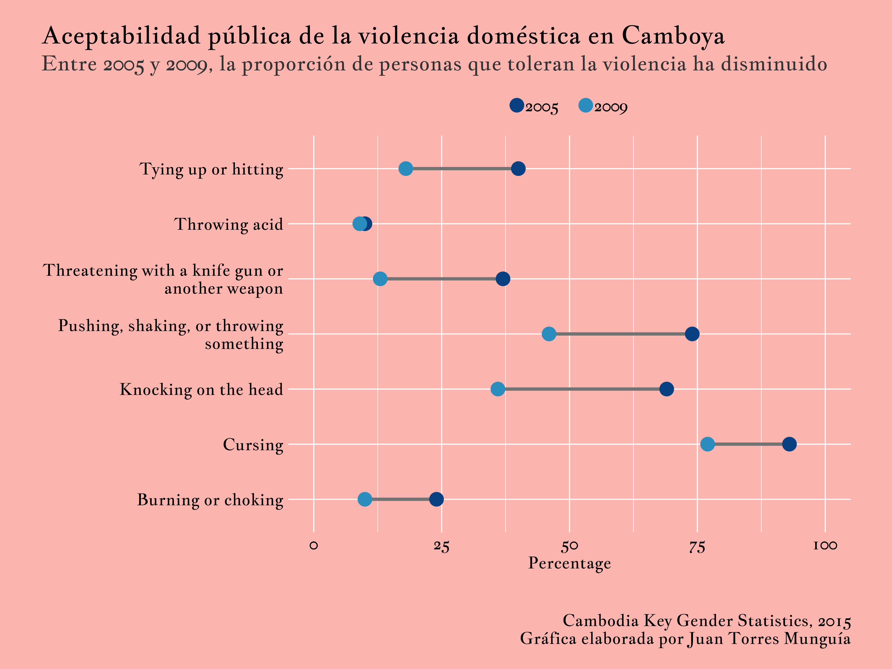

## Introducción
De acuerdo con datos oficiales del Instituto Nacional de Estadística de Camboya, en 2009 alrededor del 77 por ciento de los camboyanos de 15 a 49 años consideraban aceptable que un hombre insultara a su esposa. Aunque esta cifra es alta, representa una disminución de aproximadamente 16 puntos porcentuales en comparación con la estimación previa de 2005. Analizar estos cambios es importante para comprender mejor el fenómeno de la violencia contra mujeres y niñas.  

Una de las formas más efectivas de visualizar estos cambios en el tiempo es mediante diagramas de puntos. En esta publicación usaremos el paquete {ggplot2} en R para crear un diagrama de puntos que muestre cómo cambió la aceptación pública de la violencia doméstica en Camboya entre 2005 y 2009.  

## Preparación
Cargamos las librerías necesarias para el procesamiento y la visualización de los datos.  

```{r}
#| warning: false
library(tidyverse) # Manejo de datos
library(ggplot2) # Visualización 
library(readxl) # Leer archivos Excel
library(kableExtra) # Tablas
library(ggtext) # Formato de texto en ggplot2
library(showtext) # Fuentes personalizadas en ggplot2
library(stringr) # Para trabajar con secuencias de texto

```

## Cargando los datos
Los datos provienen del informe "Women and Men in Cambodia" elaborado por el Instituto Nacional de Estadística del Ministerio de Planificación. Este documento ofrece información sobre la situación de mujeres y hombres en diferentes ámbitos de la vida, incluyendo salud, educación, trabajo, toma de decisiones y violencia. La información usada en esta publicación se encuentra en la tabla "Public Acceptability of Domestic Violence between 2005 and 2009" in section "VIOLENCE AGAINST WOMEN". El informe está disponible [aquí](https://www.nis.gov.kh/nis/WM/Women%20and%20Men's%20in%20Cambodia%20final%20version_EN.pdf).

xtraje los datos del informe y creé un archivo Excel que puede encontrarse [aquí](acceptability-violence-cambodia.xlsx)

```{r}
#| warning: false
acceptability_violence <- read_excel("acceptability-violence-cambodia.xlsx")

```

This information looks like this:

```{r}
#| warning: false
acceptability_violence |>
  kbl(
    caption = "Aceptabilidad pública de la violencia doméstica en Camboya entre 2005 y 2009"
    ) |>
  kable_paper("hover", full_width = F)

```

Uso la función `pivot_longer()` del paquete {tidyverse} para transformar los datos a un formato largo, necesario para esta visualización.

```{r}
#| warning: false
acceptability_violence <- acceptability_violence |>
  pivot_longer(!Action, names_to = "Year", values_to = "Percentage")
```

Ahora los datos se ven así:
```{r}
#| warning: false
acceptability_violence |>
  kbl(caption = "Aceptabilidad pública de la violencia doméstica en Camboya entre 2005 y 2009") |>
  kable_paper("hover", full_width = F)

```

## Diseño del diagrama de puntos
Creo un tema personalizado para el diagrama de puntos y aplico la fuente "Jacques Francois". Más alternativas de fuentes pueden encontrarse [aquí](https://fonts.google.com/).
```{r}
#| warning: false

# Agregar fuente personalizada
font_add_google("Jacques Francois", "Jacques Francois") 

showtext_auto()

# Tema personalizado para el diagrama de puntos
theme_dot_plot <- function() {
  theme_minimal(
    base_family = "Jacques Francois" # Tema base con fuente personalizada
  ) +
    # Configuración personalizada del tema
    theme(
      # líneas de cuadrícula
      panel.grid = element_line(
        size = 0.5,
        colour = "white"
        ),

      # Configuración de ejes
      axis.line = element_blank(),
      
      axis.title.y = element_blank(),
      axis.text.y = element_text(
        color = "black",
        face = "bold",
        size = 16
      ),
      axis.title.x = element_text(
        color = "black",
        face = "bold",
        size = 16
      ),
      axis.text.x = element_text(
        color = "black",
        face = "bold",
        size = 16
      ),

      # Configuración del título
      plot.title.position = "plot", # Posición del título
      plot.title = element_text(
        color = "black",
        face = "bold",
        size = 24,
        margin = margin(5, 0, 5, 0) # arriba, derecha, abajo, izquierda
      ),
      
      # Configuración del subtítulo
      plot.subtitle = element_text(
        color = "grey20",
        face = "italic",
        size = 20,
        margin = margin(0, 0, 10, 0)
        ),
      
      # Configuración de la leyenda
      legend.position = "top",
      legend.title = element_blank(),
      legend.spacing.x = unit(0.2, "cm"),
      legend.key.spacing = unit(0.5, "cm"), # Espaciado entre elementos de la leyenda
      legend.text = element_text(
        margin = margin(5, 2, 5, 0),
        face = "bold",
        color = "black",
        size = 16
      ),
      legend.direction = "horizontal",
      legend.byrow = FALSE,
      
      # Configuración del pie de figura
      plot.caption = element_text(
        margin = margin(40, 0, 0, 0), # arriba, derecha, abajo, izquierda
        color = "black",
        size = 16
          ),
      plot.caption.position = "plot",

      plot.background = element_rect(
        color = "#FBB4AE",
        fill = "#FBB4AE"
      ),
      plot.margin = margin(20, 40, 20, 40)
    )
}

title_chart <- "Aceptabilidad pública de la violencia doméstica en Camboya"
subtitle_chart <- "Entre 2005 y 2009, la proporción de personas que toleran la violencia ha disminuido"
caption_chart <- "Cambodia Key Gender Statistics, 2015 \nGráfica elaborada por Juan Torres Munguía"

# Resolución de imagen en 320 dpi para calidad alta ("retina")
showtext_opts(dpi = 320) 

```

Finalmente, creo el diagrama de puntos usando las funciones `geom_line()` y `geom_point()` del paquete {ggplto2}.
```{r}
#| warning: false
#| output: false

dot_plot_acceptability <- acceptability_violence |> 
  ggplot(
    aes(x = Percentage, 
    y = Action)
    ) +
  geom_line(
    aes(group = Action),
    linewidth = 1.5,
    color = "#737373"
  ) +
  geom_point(
    aes(color = Year), 
    size = 6
  ) +
  scale_colour_manual(
    values = c("#084081", "#2B8CBE")
    ) +
  labs(
    title = title_chart, 
    subtitle = subtitle_chart,
    caption = caption_chart,
  ) +
  scale_x_continuous(
    limits = c(0, 100)
  ) +
  scale_y_discrete(
    # Ajustar etiquetas del eje y con un ancho de 32 caracteres
    labels = function(x) str_wrap(x, width = 32)
    ) +
  theme_dot_plot() 

```

Finalmente, exporto la gráfica con resolución de 320 dpi para alta calidad ("retina").
```{r}
#| warning: false
#| output: false

dot_plot_acceptability
showtext_opts(dpi = 320) 
ggsave(
  "cambodia-domestic-violence-dot-plot.png",
  dpi = 320,
  width = 12,
  height = 9,
  units = "in"
)

# Desactivar funcionalidad de showtext
showtext_auto(FALSE) 

```

{.lightbox fig-align="center" width=100% style="margin-top: 0px; margin-bottom: 0px;"}