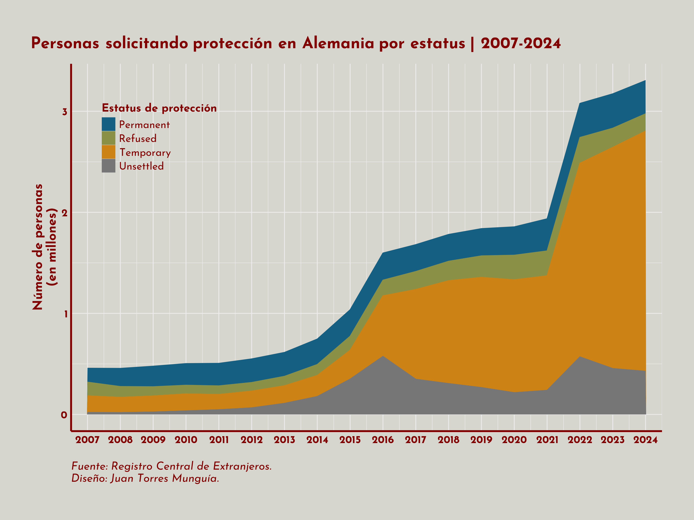

## Descripción general
En Alemania, al 31 de diciembre de 2024, según el Registro Central de Extranjeros, más de 14 millones de los 83.6 millones de habitantes son extranjeros.  

Es importante señalar que alrededor de 3.3 millones llegaron al país en busca de protección. Esta cifra es aproximadamente 78% mayor que la reportada en 2020, y 343% más que hace 10 años.  

Una herramienta eficaz para analizar estos datos son los gráficos de áreas apiladas, que permiten visualizar la evolución de la variable de interés, personas que solicitan protección en este caso, desagregándola por categorías. En esta publicación, crearé un gráfico de áreas apiladas con esta información utilizando {ggplot2} en R.

## Sobre los datos
Los datos son producidos por el Registro Central de Extranjeros y presentados por la Oficina Federal de Estadística (Destatis) en su sitio web, en la tabla [_Persons seeking protection, by protection status, 2007 to 2024_](https://www.destatis.de/EN/Themes/Society-Environment/Population/Migration-Integration/Tables/protection-time-series-protections-status.html). Descargué esta información y la guardé en un archivo de Excel llamado `persons-seeking-protection-germany.xlsx`.

## Preparación
Primero, cargo los paquetes necesarios:

```{r}
#| warning: false

library(tidyverse) 
library(kableExtra) 
library(readxl)
library(ggplot2) 
library(ggtext) 
library(ggrepel)
library(showtext) 
library(scales)

```

## Carga de datos
Descargué la tabla [_Persons seeking protection, by protection status, 2007 to 2024_
](https://www.destatis.de/EN/Themes/Society-Environment/Population/Migration-Integration/Tables/protection-time-series-protections-status.html) y la guardé en un archivo de Excel llamado `persons-seeking-protection-germany.xlsx`.

```{r}
#| warning: false
seeking_protection <- read_excel("persons-seeking-protection-germany.xlsx")

```

La tabla se ve así:
```{r}
#| warning: false
seeking_protection |>
  kbl(
    caption = "Personas solicitando protección, por estatus, 2007 a 2024"
    ) |>
  kable_paper("hover", full_width = F)

```

## Diseño del gráfico de áreas apiladas
Antes de graficar, transformo los datos y renombro algunas columnas para facilitar su uso en {ggplot2}..
```{r}
#| warning: false

seeking_protection <- seeking_protection |>
  # Extraigo el año de la fecha de referencia
  mutate(year = year(dmy(`Reference date`))) |>
  # Solo selecciono las variables de interés
  select(year, unsettled, temporary, permanent, refused) |>
  # Reestructuración de los datos a formato largo
  pivot_longer(!year, 
              names_to = "status", 
              values_to = "persons")

``` 

FA continuación, defino un tema para el gráfico y establezco la tipografía "Josefin Sans" con el paquete `showtext`Más opciones disponibles en [https://fonts.google.com/](https://fonts.google.com/).
```{r}
#| warning: false
#| output: false

font_add_google("Josefin Sans", "Josefin Sans")

showtext_auto()

theme_stacked_chart <- function() {
  theme_minimal(
    base_family = "Josefin Sans" 
  ) +
    # Ajustes personalizados
    theme(

      # Configuración de títulos
      plot.title.position = "plot", 
      plot.title = element_textbox(
        color = "#800000",
        face = "bold",
        size = 20,
        margin = margin(5, 0, 15, 0), 
        hjust = 0,
        halign = 0      ),

      plot.subtitle = element_textbox(
      color = "#767676",
      size = 18,
      margin = margin(5, 0, 35, 0),
      hjust = 0,
      halign = 0
      ),

      # Configuración de ejes
      axis.line = element_line(
        size = 1.1, 
        colour = "#800000"
        ),

      axis.title.y = element_text(
        color = "#800000",
        face = "bold",
        size = 16
      ),
      axis.text.y = element_text(
        color = "#800000",
        face = "bold",
        size = 13
      ),
      axis.title.x = element_blank(),
      axis.text.x = element_text(
        color = "#800000",
        face = "bold",
        size = 13
      ),

      # Configuración de la leyenda
      legend.position.inside = c(0.15, 0.80),
      legend.title = element_text(
        color = "#800000",
        face = "bold",
        size = 14
      ),
      legend.text = element_text(
        color = "#800000",
        size = 13
      ),

      # Configuración del pie de figura
      plot.caption = element_text(
        color = "#800000",
        face = "italic",
        size = 14,
        hjust = 0,
        margin = margin(20, 0, 5, 0), 
        ),

      plot.background = element_rect(
        color = "#D6D6CE",
        fill = "#D6D6CE"
      ),
      plot.margin = margin(40, 40, 40, 40) 
    )
}

```

El gráfico se crea con el siguiente código:
```{r}
#| warning: false
#| output: false

seeking_protection <- seeking_protection |>
  mutate(status = str_to_title(status))

ggplot(seeking_protection,
  aes(
      x = year,
      y = persons,
      fill = status,
      color = status
      )
    ) +
  geom_area() +
  guides(fill = guide_legend(title = "Estatus de protección", 
                             position = "inside"),
         color = guide_legend(title = "Estatus de protección", 
                             position = "inside")
                             ) +
  scale_fill_manual(
    values = c("Unsettled"= "#767676",
               "Temporary"= "#CC8214", 
               "Refused" = "#8A9045",
               "Permanent" = "#155F83"
               )
  ) + 
  scale_color_manual(
    values = c("Unsettled"= "#767676",
               "Temporary"= "#CC8214", 
               "Refused" = "#8A9045",
               "Permanent" = "#155F83"
               )
  ) + 
  scale_y_continuous(
    labels = label_number(
      scale = 1e-6
      )
    ) +
  scale_x_continuous(
    expand = c(0, 0),
    limits = c(2006.5, 2024.5), 
    breaks = seq(2007, 2024, by = 1)
  ) +
  labs(
    title = "Personas solicitando protección en Alemania por estatus | 2007-2024",
    y = "Número de personas \n(en millones)",
    caption = "Fuente: Registro Central de Extranjeros. \nDiseño: Juan Torres Munguía."
    ) + 
  theme_stacked_chart() 

showtext_opts(dpi = 320) 
ggsave(
  "stacked-area-germany-seeking-protection.png",
  dpi = 320,
  width = 12,
  height = 9,
  units = "in"
)
showtext_auto(FALSE) # Desactiva la funcionalidad de showtext

```

{width=100% style="margin-top: 0px; margin-bottom: 0px;" .lightbox}
