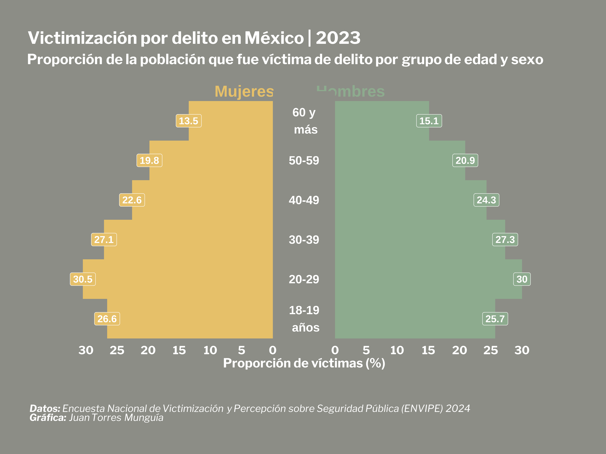

## Introducción
Las pirámides poblacionales son una forma útil de visualizar datos demográficos, especialmente al analizar patrones de edad y sexo. En este post, elaboraré una pirámide poblacional utilizando el paquete {ggplot2} en R, enfocándome específicamente en los datos de victimización por delito de la **Encuesta Nacional de Victimización y Percepción sobre Seguridad Pública (ENVIPE)** de México.

## Configuración inicial
Primero, necesitamos instalar y cargar los paquetes de R necesarios.  

```{r}
#| warning: false

library(tidyverse) # Siempre cargo tidyverse para manejar datos
library(ggplot2) # Para visualización
library(ggtext) # Para dar formato al texto en ggplot2
library(showtext) # Para fuentes personalizadas en ggplot2
library(readxl) # Para leer archivos Excel
library(kableExtra) # Para tablas de datos

```

## Carga de datos

Utilizaré la tabla **Población de 18 años y más por entidad federativa y grupos de edad según sexo y condición de victimización** de la ENVIPE 2024, disponible [aquí](https://www.inegi.org.mx/programas/envipe/2024/#tabulados). 

```{r}
#| warning: false
envipe_data <- read.csv("victimization-age-sex-Mexico.csv")

```

Los datos son los siguientes:

```{r}
#| warning: false
envipe_data |>
  kbl(caption = "Prevalencia de victimización según edad y sexo en México, 2023") |>
  kable_paper("hover", full_width = F)

```

Luego, utilizamos el paquete {tidyverse} para preparar los datos antes de graficar.

```{r}
#| warning: false

envipe_data <- envipe_data |>
  mutate(Prevalence = case_when(Sex == "Women" ~ -1*Prevalence - 5,
                                TRUE ~ Prevalence + 5)) |>
  mutate(Age = factor(Age, levels = c("18-19", "20-29", "30-39", "40-49", "50-59", "+60"))) 

```

## Creando la pirámide poblacional
Primero, estimamos los límites ajustados para el eje x.  

```{r}
#| warning: false

prevalence_breaks <- seq(0, 30, by = 5)
# Sumamos 5 para crear un espacio en el centro de la gráfica
prevalence_breaks_adjusted <- c(prevalence_breaks + 5, -1*prevalence_breaks - 5)

```

Luego, creo un tema personalizado para la gráfica y establezco la fuente "Libre Franklin" usando el paquete showtext. Más opciones de fuentes están disponibles en [https://fonts.google.com/](https://fonts.google.com/).
```{r}
#| warning: false
#| output: false

font_add_google("Libre Franklin", "Libre Franklin")

showtext_auto()

# Tema personalizado para la gráfica
theme_pyramid_chart <- function() {
  theme_minimal(
    base_family = "Libre Franklin" 
  ) +
    # Ajustes personalizados del tema
    theme(
      # quitar líneas de la cuadrícula
      panel.grid = element_blank(),

      # Configuración de ejes
      axis.title.y = element_blank(),
      axis.text.y = element_blank(),
      axis.title.x = element_text(
        color = "white",
        face = "bold",
        size = 18
      ),
      axis.text.x = element_text(
        color = "white",
        face = "bold",
        size = 16
      ),

      # Configuración del título
      plot.title.position = "plot", 
      plot.title = element_textbox(
        color = "white",
        face = "bold",
        size = 24,
        margin = margin(5, 0, 5, 0), # arriba, derecha, abajo, izquierda
        width = unit(1, "npc") 
      ),

      plot.subtitle = element_textbox(
      color = "white",
      face = "bold",
      size = 20,
      margin = margin(5, 0, 35, 0),
      width = unit(1, "npc")
    ),

      # Configuración de la leyenda
      legend.position = "none",

      # Configuración del pie de página
      plot.caption = element_markdown(
        color = "white",
        face = "italic",
        size = 14,
        hjust = 0,
        margin = margin(50, 0, 5, 0) # arriba, derecha, abajo, izquierda
        ),
      plot.background = element_rect(
        color = "#8C8D86",
        fill = "#8C8D86"
      ),
      plot.margin = margin(40, 40, 40, 40) # arriba, derecha, abajo, izquierda
    )
}

title_chart <- "Victimización por delito en México | 2023"
subtitle_chart <- "Proporción de la población que fue víctima de delito por grupo de edad y sexo"
caption_chart <- paste0("**Datos:** Encuesta Nacional de Victimización y Percepción sobre Seguridad Pública (ENVIPE) 2024",
                        "<br>", 
                        "**Gráfica:** Juan Torres Munguía")

```

Finalmente, uso `geom_col()`, `geom_label()`, and `annotate()` del paquete {ggplot2} para diseñar la gráfica. 
```{r}
#| warning: false
#| output: false

envipe_data |> 
  ggplot(aes(x = Age, 
             y = Prevalence, 
             fill = Sex)
        ) +
  geom_col(width = 1) +
  scale_fill_manual(
    values = c("Women" = "#E6C069", 
               "Men" = "#8DAB8E")) + 
  geom_label(
    aes(label = round(
      abs(Prevalence)-5, 1 # Redondear la cifra
      ), 
        y = Prevalence),
        color = "white",
        size = 5,
        fontface = "bold"
        ) +
  coord_flip(clip = "off") + 
  annotate(
    geom = "text",
    x = 6.75, 
    y = 7.5, 
    label = "Hombres",
    size = 8, 
    color = "#8DAB8E",
    fontface = "bold") +
  # Agregar anotaciones para el sexo de la víctima
  annotate(
    geom = "text",
    x = 6.75, 
    y = -9.5, 
    label = "Mujeres",
    size = 8, 
    color = "#E6C069",
    fontface = "bold") +
  # Agregar un rectángulo en el centro de la gráfica
  # Este rectángulo contendrá las etiquetas del eje x (la gráfica está invertida)
  # y se incluye entre los valores -5 y 5 del eje y (invertido)
  annotate(
    geom = "rect", 
    xmin = -Inf, 
    xmax = Inf, 
    ymin = 5, 
    ymax = -5,
    fill = "#8C8D86") + 
  # Etiquetas para el eje vertical (grupos de edad)
  annotate(
    geom = "text",
    x = c("18-19", "20-29", "30-39", "40-49", "50-59", "+60"), 
    y = 0, 
    label = c("18-19 \n años", "20-29", "30-39", "40-49", "50-59", "60 y \n más"),
    size = 6, 
    color = "white",
    fontface = "bold") +
  # Agrego manualmente un rango -40, 40 para incluir el espacio en el centro
  scale_y_continuous(
    limits = c(-40, 40),
    breaks = prevalence_breaks_adjusted,
    # Las etiquetas se renombran para vincularse a los valores reales del eje x,
    # eliminando el espacio en el centro
    labels = function(x) {abs(x) - 5}) + 
  labs(
    title = title_chart,
    subtitle = subtitle_chart,
    caption = caption_chart,
    x = "",
    y = "Proporción de víctimas (%)",
    fill = "") +
  theme_pyramid_chart()

# Configurar la resolución de la imagen (320 dpi es calidad alta "retina")
showtext_opts(dpi = 320) 
ggsave(
  "pyramid-crime-mexico.png",
  dpi = 320,
  width = 12,
  height = 9,
  units = "in"
)
showtext_auto(FALSE) # Apagar la funcionalidad de showtext

```

{width=100% style="margin-top: 0px; margin-bottom: 0px;" .lightbox}