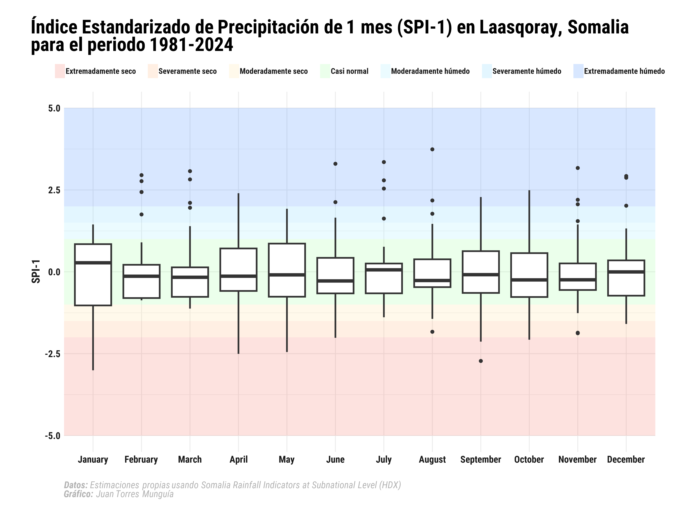

## Descripción general
El Índice de Precipitación Estandarizado (SPI, por sus siglas en inglés) cuantifica cómo la precipitación se desvía del promedio histórico en múltiples escalas temporales (por ejemplo, de 1 a 12 meses), lo que permite un monitoreo consistente de sequías e inundaciones a través de regiones y en el tiempo, convirtiéndolo en una herramienta valiosa para los sistemas de alerta temprana y de evaluación de riesgos.

En este tutorial, explicaré el proceso para calcular el SPI para Somalia a nivel subnacional utilizando el paquete {SCI} en R.

## Acerca de los datos
El conjunto de datos de precipitaciones utilizado en este tutorial proviene de la [iniciativa Humanitarian Data Exchange (HDX)](https://data.humdata.org/) de la Oficina de Coordinación de Asuntos Humanitarios de las Naciones Unidas (OCHA) y proporciona datos mensuales de precipitación para los distritos subnacionales de Somalia. Se deriva de CHIRPS v2 (Climate Hazards Group InfraRed Precipitation with _in situ_ Station data), utilizando imágenes satelitales combinadas con observaciones terrestres.

Para cada período de 10 días (dekad), el conjunto de datos incluye los siguientes indicadores:

- `rfh`: Precipitación total (mm) en 10 días  
- `r1h`: Suma móvil de precipitación de 1 mes (mm)  
- `r3h`: Suma móvil de precipitación de 3 meses (mm)  
- `rfh_avg`: Promedio de largo plazo de la precipitación para el dekad (mm)  
- `r1h_avg`: Promedio de largo plazo para la precipitación de 1 mes (mm)  
- `r3h_avg`: Promedio de largo plazo para la precipitación de 3 meses (mm)  
- `rfq`: Anomalía de precipitación (%)  
- `r1q`: Anomalía de precipitación (%)  
- `r3q`: Anomalía de precipitación a 3 meses (%)  

Los datos están agregados a nivel subnacional y siguen los límites administrativos definidos por el Programa Mundial de Alimentos (WFP), con cada unidad asignada a un código único (`Pcode`).

## Configuración
Antes de comenzar, necesitamos instalar y cargar los paquetes necesarios en R. Utilizaremos el paquete {tidyverse} para el manejo de datos, así como el paquete {SCI} para calcular el SPI.

```{r}
#| warning: false

library(tidyverse) 
library(SCI) # Para cálculos del Índice de Precipitación Estandarizado (análisis climático)
library(conflicted) # Para resolver conflictos entre nombres de funciones en diferentes paquetes
library(kableExtra) 

library(ggplot2) 
library(ggtext) 
library(showtext) 

conflicts_prefer(dplyr::select) # Preferir la función 'select' del paquete dplyr
conflicts_prefer(dplyr::lag) # Preferir la función 'lag' del paquete dplyr
conflicts_prefer(dplyr::filter) # Preferir la función 'filter' del paquete dplyr
```

::: {.callout-warning}

Es importante usar el paquete {conflicted} para especificar las funciones preferidas y evitar conflictos de nombres entre los paquetes {tidyverse} y {SCI}.

:::

## Cargando los datos de HDX
Los datos se pueden encontrar [aquí](https://data.humdata.org/dataset/som-rainfall-subnational) en el archivo `som-rainfall-adm2-full.csv`. Para Somalia, los datos están disponibles desde enero de 1981.

```{r}
#| warning: false

# Leer los datos de precipitación para Somalia
# También puedes descargar los datos desde la plataforma HDX y leerlos localmente
rainfall_data <- read.csv("https://data.humdata.org/dataset/ed6e1b4b-8094-47e6-bdf7-f6d56fa7abb9/resource/8b333d58-d69e-418c-b5e3-dd86f12eee05/download/som-rainfall-subnat-full.csv")
```

### Preparación de datos

Preprocesamos los datos para extraer la información relevante para calcular el SPI. Extraemos el año y el mes de la columna de fecha, calculamos la anomalía de precipitación y agrupamos los datos year, month, y district_code. 

```{r}
#| warning: false

rainfall_data <- rainfall_data |>
  slice(-1) |> # Eliminar la primera fila (metadatos)
  filter(adm_level == 2) |>
  mutate(
    year = year(date), # Extraer año de la columna 'date'
    month = month(date), # Extraer mes de la columna 'date'
    district_code = PCODE # Renombrar la columna 'PCODE' como 'district_code'
  ) |>
  filter(year < 2025) |> # Filtrar datos hasta 2024
  rename(
    rainfall_monthly_total = rfh, # Renombrar 'rfh' como 'rainfall_monthly_total'
    rainfall_monthly_lt_average = rfh_avg # Renombrar 'rfh_avg' como 'rainfall_monthly_lt_average'
  ) |>
  mutate(
    rainfall_monthly_total = as.numeric(rainfall_monthly_total), # Convertir precipitación total a numérico
    rainfall_monthly_lt_average = as.numeric(rainfall_monthly_lt_average) # Convertir promedio de largo plazo a numérico
  ) |>
  select(year, month, district_code, rainfall_monthly_total, rainfall_monthly_lt_average) # Seleccionar columnas relevantes

# Agrupar por año, mes y district_code, y calcular la precipitación promedio por distrito
rainfall_data <- rainfall_data |>
  group_by(year, month, district_code) |>
  summarise(
    rainfall_monthly_total = mean(rainfall_monthly_total, na.rm = TRUE), # Calcular promedio de precipitación total
    rainfall_monthly_lt_average = mean(rainfall_monthly_lt_average, na.rm = TRUE) # Calcular promedio de largo plazo
  ) |>
  ungroup() |>
  mutate(
    rainfall_anomaly = rainfall_monthly_total / rainfall_monthly_lt_average # Anomalía de precipitación
  )
```

## Cálculo del SPI en diferentes escalas temporales (1, 3, 6, 12 meses).
```{r}
#| warning: false

rainfall_data <- rainfall_data |>
  group_by(district_code) |>
  mutate(
    spi1 = transformSCI(
      rainfall_monthly_total,
      first.mon = 1,
      obj = fitSCI(rainfall_monthly_total,
        first.mon = 1,
        time.scale = 1,
        distr = "gamma",
        p0 = TRUE
      )
    ),
    spi3 = transformSCI(
      rainfall_monthly_total,
      first.mon = 1,
      obj = fitSCI(rainfall_monthly_total,
        first.mon = 1,
        time.scale = 3,
        distr = "gamma",
        p0 = TRUE
      )
    ),
    spi6 = transformSCI(
      rainfall_monthly_total,
      first.mon = 1,
      obj = fitSCI(rainfall_monthly_total,
        first.mon = 1,
        time.scale = 6,
        distr = "gamma",
        p0 = TRUE
      )
    ),
    spi12 = transformSCI(
      rainfall_monthly_total,
      first.mon = 1,
      obj = fitSCI(rainfall_monthly_total,
        first.mon = 1,
        time.scale = 12,
        distr = "gamma",
        p0 = TRUE
      )
    )
  ) |>
  ungroup() |>
  arrange(district_code)
```

La tabla de salida se ve así: 
```{r}
#| echo: false

rainfall_data |>
  head(n = 10) |>
  kbl() |> # HTML table
  kable_styling() # Usar bootstrap theme en la tabla
```

## Interpretación
Los eventos de sequía se indican con valores negativos del SPI, siendo los valores más negativos los que indican condiciones de sequía más severas. Por el contrario, los valores positivos indican condiciones más húmedas de lo normal. Como ejemplo, visualicemos los valores SPI para el distrito de Laasqoray en la región de Sanaag. Una forma eficiente de visualizar los valores SPI es mediante un diagrama de caja con categorías de SPI.

```{r}
#| warning: false
#| output: false

font_add_google("Roboto Condensed", "Roboto Condensed")

showtext_auto()

# Tema personalizado para la gráfica
theme_boxplot_chart <- function() {
  theme_minimal(
    base_family = "Roboto Condensed" 
  ) +
    # Configuración del tema
    theme(
      # Ejes
      axis.title = element_text(
        color = "grey10",
        face = "bold",
        size = 14
      ),
      axis.text = element_text(
        color = "grey10",
        face = "bold",
        size = 12
      ),

      # Título
      plot.title.position = "plot", 
      plot.title = element_textbox(
        color = "black",
        face = "bold",
        size = 24,
        margin = margin(5, 0, 5, 0), 
        width = unit(1, "npc") 
      ),

      # Leyenda
      legend.position = "top",
      legend.title = element_blank(),
      legend.key.height = unit(0.5, "cm"),
      legend.key.width = unit(0.5, "cm"),
      legend.spacing.x = unit(0.2, "cm"),
      legend.key.spacing = unit(0.5, "cm"), 
      legend.text = element_text(
        margin = margin(5, 0, 5, 0),
        face = "bold",
        color = "grey10",
        size = 10
      ),
      legend.direction = "horizontal",
      legend.byrow = FALSE,

      # Nota al pie
      plot.caption = element_markdown(
        color = "grey70",
        face = "italic",
        size = 12,
        hjust = 0
        ),
      plot.background = element_rect(
        color = "white",
        fill = "white"
      ),
      plot.margin = margin(20, 40, 20, 40)
    )
}

title_chart <- "Índice Estandarizado de Precipitación de 1 mes (SPI-1) en Laasqoray, Somalia para el periodo 1981-2024"
caption_chart <- paste0("**Datos:** Estimaciones propias usando *Somalia Rainfall Indicators at Subnational Level* (HDX)",
                        "<br>", 
                        "**Gráfico:** Juan Torres Munguía")

#
spi_colors <- data.frame(
  ymin = c(-5, -2, -1.5, -1, 0, 1, 1.5, 2),
  ymax = c(-2, -1.5, -1, 0, 1, 1.5, 2, 5),
  label = factor(
    c(
      "Extremadamente seco", "Severamente seco", "Moderadamente seco", "Casi normal",
      "Casi normal", "Moderadamente húmedo", "Severamente húmedo", "Extremadamente húmedo"
    ),
    levels = c(
      "Extremadamente seco", "Severamente seco", "Moderadamente seco", "Casi normal",
      "Moderadamente húmedo", "Severamente húmedo", "Extremadamente húmedo"
    )
  ),
  fill = c(
    "#F76D5E", "#FFAD72", "#FFE099", "#99FF99",
    "#99FF99", "#99EAFF", "#75D3FF", "#3D87FF"
  )
)

rainfall_data |>
  filter(district_code == "SO1503") |>
  mutate(month = factor(month, levels = 1:12, labels = month.name)) |> # Convertir mes a factor
  ggplot(aes(x = month, y = spi1)) +

  # Agregar diagrama de caja con categorías de SPI
  geom_rect(
    data = spi_colors, aes(ymin = ymin, ymax = ymax, xmin = -Inf, xmax = Inf, fill = label),
    alpha = 0.2, inherit.aes = FALSE
  ) +
  geom_boxplot(size = 1, outlier.size = 2, outlier.shape = 16) +
  scale_fill_manual(values = setNames(spi_colors$fill, spi_colors$label)) +
  labs(
    title = title_chart,
    caption = caption_chart,
    x = "",
    y = "SPI-1",
    fill = ""
  ) +
  guides(fill = guide_legend(nrow = 1)) + # Número de filas en la leyenda
  theme_boxplot_chart()

showtext_opts(dpi = 320) # Establecer la resolución de la imagen (320 dpi para imágenes de alta calidad "retina")
ggsave(
  "spi-somalia.png",
  dpi = 320,
  width = 12,
  height = 9,
  units = "in"
)
showtext_auto(FALSE) # Apagar la funcionalidad de showtext
```

{width=100% style="margin-top: 0px; margin-bottom: 0px;" .lightbox}
