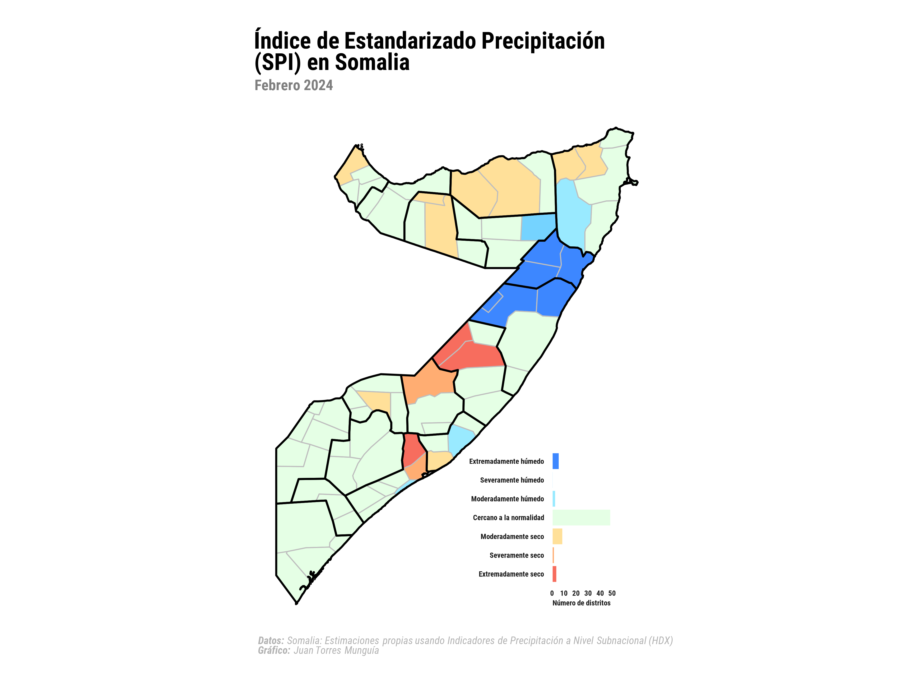

## Resumen
Anteriormente, en [la Parte 1 de este tutorial](../spi_somalia/index.qmd), calculamos el Índice de Precipitación Estandarizado (SPI) para diferentes escalas temporales usando el paquete {SCI} en R. Ahora, vamos a mapear los valores de SPI para los distritos de Somalia usando los paquetes {sf} y {ggplot2} en R.

## Sobre los datos
La información de las fronteras administrativas subnacionales de Somalia se obtiene de la [iniciativa Humanitarian Data Exchange (HDX)](https://data.humdata.org/) de la Oficina de Coordinación de Asuntos Humanitarios de las Naciones Unidas (OCHA). La información viene en formato shapefile `.shp` y está disponible [aquí](https://data.humdata.org/dataset/cod-ab-som?) en un archivo zip llamado `som_adm_ocha_20250108_AB_SHP.zip`. El shapefile contiene las fronteras administrativas de Somalia a nivel subnacional. En particular, utilizaremos el archivo `som_admbnda_ADM2_ocha_20250108.shp`, que contiene el shapefile de Somalia a nivel de distrito. Descargué este archivo y lo ubiqué en la carpeta `/shp`.

## Configuración
Antes de comenzar, necesitamos instalar y cargar los paquetes de R necesarios.

```{r}
#| warning: false

library(tidyverse) 
library(sf) 

library(ggplot2) 
library(ggtext) 
library(showtext) 
library(patchwork) 

```

## Cargando los datos de HDX

Los datos se pueden encontrar [aquí](https://data.humdata.org/dataset/som-rainfall-subnational) en el archivo `som-rainfall-adm2-full.csv`. Para Somalia, los datos están disponibles desde enero de 1981.

```{r}
#| warning: false

shp_somalia <- read_sf("shp/som_admbnda_adm2_ocha_20250108.shp")

shp_somalia <- shp_somalia |>
  rename(
    district = ADM2_EN, 
    district_code = ADM2_PCODE
  )
```

### Procesamiento de datos
Agregaré los valores de SPI calculados previamente al dataframe del shapefile. Guardé los valores de SPI en un archivo RData llamado `rainfall_data.RData`.

```{r}
#| warning: false

load("rainfall_data.RData")

# Primero, necesitamos filtrar los valores de SPI para el último mes disponible, es decir, diciembre de 2024
# para tener solo una observación por distrito
rainfall_data_dec2024 <- rainfall_data |>
  filter(month == 2 & year == 2024)

# Fusionar el shapefile con los valores de SPI
shp_somalia <- shp_somalia |>
  left_join(rainfall_data_dec2024, by = c("district_code"))
```

## Configuración del tema y definición de fuentes, colores y textos para el mapa
```{r}
#| warning: false

font_add_google("Roboto Condensed", "Roboto Condensed")

showtext_auto()

theme_spi_map <- function() {
  theme_minimal(
    base_family = "Roboto Condensed" 
  ) +
    # Configuración personalizada del tema
    theme(

      # Configuración del título
      plot.title.position = "plot", 
      plot.title = element_textbox(
        color = "black",
        face = "bold",
        size = 22,
        margin = margin(5, 0, 5, 0), 
        width = unit(1, "npc") 
      ),
      plot.subtitle = element_textbox(
        color = "grey50",
        face = "bold",
        size = 14,
        margin = margin(20, 0, 10, 0),
        width = unit(1, "npc")
      ),

      legend.position = "top",
      legend.title = element_blank(),
      legend.key.height = unit(0.1, "cm"), 
      legend.key.width = unit(0.1, "cm"), 
      legend.spacing.x = unit(0.1, "cm"),
      legend.key.spacing = unit(0.1, "cm"), 
      legend.text = element_text(
        margin = margin(5, 0, 5, 0),
        face = "bold",
        color = "grey10",
        size = 10
      ),
      legend.direction = "horizontal",
      legend.byrow = FALSE,

      # Configuración de la caption
      plot.caption = element_markdown(
        color = "grey70",
        face = "italic",
        size = 10,
        hjust = 0
      ),
      plot.background = element_rect(
        color = "white",
        fill = "white"
      ),
      plot.margin = margin(20, 40, 20, 40)
    )
}

# Título, subtítulo y caption para el gráfico
title_chart <- "Índice de Estandarizado Precipitación (SPI) en Somalia"
subtitle_chart <- "Febrero 2024"
caption_chart <- "**Datos:** Somalia: Estimaciones propias usando Indicadores de Precipitación a Nivel Subnacional (HDX) <br> **Gráfico:** Juan Torres Munguía"
```

Ahora, vamos a crear un histograma de los valores de SPI para los distritos de Somalia, que usaremos como leyenda para el mapa.
```{r}
spi_colors <- data.frame(
  ymin = c(-5, -2, -1.5, -1, 0, 1, 1.5, 2),
  ymax = c(-2, -1.5, -1, 0, 1, 1.5, 2, 5),
  label = factor(
    c(
      "Extremadamente seco", "Severamente seco", "Moderadamente seco", "Cercano a la normalidad",
      "Cercano a la normalidad", "Moderadamente húmedo", "Severamente húmedo", "Extremadamente húmedo"
    ),
    levels = c(
      "Extremadamente seco", "Severamente seco", "Moderadamente seco", "Cercano a la normalidad",
      "Moderadamente húmedo", "Severamente húmedo", "Extremadamente húmedo"
    )
  ),
  fill = c(
    "#F76D5E", "#FFAD72", "#FFE099", "#E5FFE5",
    "#E5FFE5", "#99EAFF", "#75D3FF", "#3D87FF"
  )
)

shp_somalia <- shp_somalia %>%
  mutate(spi_category = cut(spi1,
    breaks = c(-Inf, spi_colors$ymax),
    labels = spi_colors$label,
    right = TRUE
  )) |> # right = TRUE significa que los intervalos son cerrados por la derecha
  filter(!is.na(spi1))

histogram_spi <- shp_somalia |>
  filter(!is.na(spi_category)) |>
  ggplot(aes(x = spi_category, fill = spi_category)) +
  geom_bar(color = "white") +
  scale_fill_manual(values = setNames(spi_colors$fill, spi_colors$label)) +
  labs(
    title = "",
    x = "",
    y = "Número de distritos"
  ) +
  theme_spi_map() +
  theme(
    legend.position = "none",
    axis.title = element_text(
      color = "grey10",
      face = "bold",
      size = 7
    ),
    axis.text = element_text(
      color = "grey10",
      face = "bold",
      size = 7
    ),
    axis.line = element_blank(),
    panel.grid = element_blank()
  ) +
  coord_flip()
```

```{r}
#| warning: false

# Leer el shapefile de Somalia con las fronteras de las regiones interiores
shp_somalia_region <- read_sf("shp/som_admbnda_adm1_ocha_20250108.shp")

shp_somalia_region <- st_transform(shp_somalia_region, 3857) # Proyección Web Mercator
shp_somalia <- st_transform(shp_somalia, 3857)

map_spi <- ggplot() +
  geom_sf(
    data = shp_somalia, aes(fill = spi_category), color = "grey", linewidth = 0.5
  ) +
  scale_fill_manual(values = setNames(spi_colors$fill, spi_colors$label)) +
  geom_sf(data = shp_somalia_region, fill = NA, color = "black", linewidth = 0.9) +
  labs(
    title = title_chart,
    subtitle = subtitle_chart,
    caption = caption_chart,
    x = "",
    y = "",
    fill = ""
  ) +
  theme_spi_map() +
  theme(
    legend.position = "none",
    # Configuración de los ejes
    axis.title = element_blank(),
    axis.line = element_blank(),
    axis.text = element_blank(),
    axis.ticks = element_blank(),
    panel.grid = element_blank()
  )
```

```{r}
#| warning: false
#| output: false

map_spi +
  inset_element(histogram_spi, left = 0.4, bottom = 0, right = 1, top = 0.4, on_top = FALSE)

showtext_opts(dpi = 320) 
ggsave(
  "spi-somalia-map.png",
  dpi = 320,
  width = 12,
  height = 9,
  units = "in"
)
showtext_auto(FALSE)
```

{width=100% style="margin-top: 0px; margin-bottom: 0px;".lightbox}
