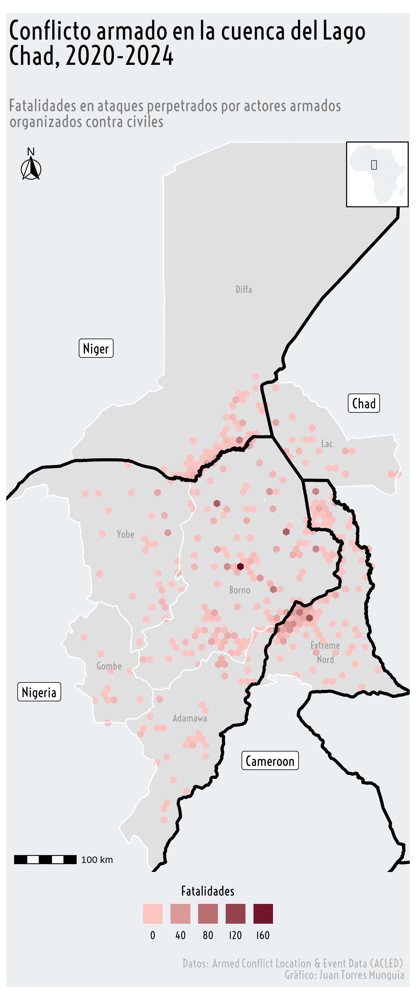

## Descripción general  
[ACLED (Armed Conflict Location & Event Data Project)](https://acleddata.com/) proporciona datos detallados sobre violencia política y eventos de protesta en todo el mundo. Esta publicación explora la visualización del conflicto armado en la Cuenca del Lago Chad, enfocándose en la dinámica de la violencia contra civiles en la región. Usando los datos de ACLED en combinación con los *shapefiles* de la [iniciativa Humanitarian Data Exchange (HDX)](https://data.humdata.org/) de la Oficina de Coordinación de Asuntos Humanitarios de las Naciones Unidas (OCHA), con los paquetes {ggplot2}, {sf} y {tidyverse} para crear mapas del impacto del conflicto armado.  

## Preparación  
Cargar las librerías necesarias para el procesamiento y la visualización de datos.  

```{r}
#| warning: false

library(tidyverse)      # Para manipulación y visualización de datos
library(sf)             # Para trabajar con datos espaciales
library(ggplot2)        # Para visualización de datos
library(patchwork)      # Para combinar gráficos
library(ggtext)         # Para usar texto enriquecido en ggplot
library(showtext)       # Para añadir tipografías a los gráficos
library(ggspatial)      # Para interactuar con datos espaciales en ggplot2
library(rnaturalearth)  # Para obtener datos de mapas que pueden visualizarse con otros paquetes de R
library(rnaturalearthdata) # Para almacenar datos usados por el paquete rnaturalearth

# Configurar el entorno en inglés (para formato de fechas/tiempo)
invisible(Sys.setenv(LANG = "en"))
invisible(Sys.setlocale("LC_TIME", "English"))
```

## Cargando datos  
Acceder a los datos de ACLED requiere registrarse en su [Portal de Acceso ACLED](https://developer.acleddata.com/) para generar una clave de acceso única. Una vez registrado, puedes descargar los datos usando su [Herramienta de Exportación de Datos](https://acleddata.com/data-export-tool/). Yo descargué todos los eventos ocurridos en África desde 1997 y los guardé en el archivo `acled_africa_1997-2025.csv`. Para una mejor comprensión de los datos, ACLED proporciona un [manual de códigos](https://acleddata.com/acleddatanew/wp-content/uploads/dlm_uploads/2024/10/ACLED-Codebook-2024-7-Oct.-2024.pdf).
```{r}
#| warning: false

conflict_data <- read.csv("acled_africa_1997-2025.csv")
```

## Carga de datos
La información de los límites administrativos nacionales y subnacionales en la Cuenca del Lago Chad se obtiene de **HDX**. Esta información se encuentra en un shapefile `.shp` y está disponible [aquí](https://data.humdata.org/dataset/lac-chad-basin-area?force_layout=desktop) en un archivo comprimido llamado `lcb_admbnda_adm2_ocha.zip`. El shapefile contiene los límites administrativos de la región de la Cuenca del Lago Chad a nivel subnacional. En particular, utilizaremos el archivo `lcb_admbnda_adm2_ocha.shp`. Además, descargué los límites administrativos de la región de África Occidental y Central, disponibles [aquí](https://data.humdata.org/dataset/west-and-central-africa-administrative-boundaries-levels).

```{r}
#| warning: false

# Lake Chad Basin Area - Administrative boundaries for Nigeria, Chad, Cameroon and Niger
shp_lake_chad_basin <- read_sf("lcb_admbnda_adm2_ocha/lcb_admbnda_adm2_ocha.shp")

# West and Central Africa - Administrative boundaries levels 0 - 2 and Settlements
west_central_africa <- read_sf("wca_admbnda_adm2_ocha/wca_admbnda_adm2_ocha.shp")
```

## Procesamiento de datos
Como se indica en el [manual de ACLED](https://acleddata.com/acleddatanew/wp-content/uploads/dlm_uploads/2024/10/ACLED-Codebook-2024-7-Oct.-2024.pdf), la ubicación geográfica de los eventos se especifica en las columnas `latitude` y `longitude` del objeto `conflict_data` y utilizan el sistema de referencia de coordenadas [EPSG:4326](https://epsg.io/4326). Debemos asegurarnos de que tanto `shp_lake_chad_basin` como `west_central_africa` tengan el mismo sistema de referencia de coordenadas. Para lograr esto, usamos `st_transform()` del paquete {sf}. 
```{r}
#| warning: false

# st_transform para convertir el sistema de referencia de coordenadas de los datos de ACLED
shp_lake_chad_basin <- st_transform(shp_lake_chad_basin,
  crs = 4326
)
west_central_africa <- st_transform(west_central_africa,
  crs = 4326
)
```

Ahora, seleccionamos únicamente los eventos ocurridos entre 2020 y 2024 en la cuenca del Lago Chad. Para esto, utilizamos el paquete {tidyverse} para la manipulación de datos y {sf} para el filtrado espacial. Aplicando la función `st_filter`, conservamos únicamente los eventos ubicados dentro del área de la cuenca del Lago Chad.
```{r}
#| warning: false

conflict_data <- conflict_data |>
  # Conservar únicamente los eventos de 2020 a 2024
  filter(year >= 2020 & year < 2025) |>
  # Seleccionar únicamente los eventos de "Violencia contra civiles" del tipo "Ataque"
  filter(event_type == "Violence against civilians" & sub_event_type == "Attack") |>
  # Conservar eventos de Nigeria, Níger, Camerún y Chad
  filter(country %in% c("Nigeria", "Niger", "Cameroon", "Chad")) |>
  # Extraer el nombre del mes a partir de event_date
  mutate(
    month = month(dmy(event_date),
      label = TRUE
    )
  ) |>
  # Seleccionar únicamente las columnas relevantes
  select(
    event_id_cnty, event_date, month, year, event_type, sub_event_type,
    actor1, actor2, location, latitude, longitude, fatalities, notes
  )

# Convertir los datos a un objeto espacial usando latitud y longitud (CRS WGS 84)
conflict_data <- st_as_sf(conflict_data,
  coords = c("longitude", "latitude"),
  crs = 4326
)

# Filtrar los eventos que caen dentro del shapefile de la cuenca del Lago Chad
conflict_data_lake_chad <- conflict_data |>
  st_filter(shp_lake_chad_basin)
```

Luego, procesamos los datos de los límites administrativos para extraer las regiones relevantes en África Occidental y Central, centrándonos en el área de la cuenca del Lago Chad.
```{r}
#| warning: false

# Filtrar para incluir solo países en la región de la cuenca del Lago Chad
# Incluí República Centroafricana con fines de visualización
shp_countries <- west_central_africa |>
  filter(admin0Name %in% c("Nigeria", "Niger", "Chad", "Cameroon", "Central African Republic"))

# Crear códigos de país y formatear códigos de divisiones administrativas
shp_countries <- shp_countries |>
  mutate(
    country_code = case_when(
      admin0Name == "Nigeria" ~ "NGA",
      admin0Name == "Niger" ~ "NER",
      admin0Name == "Chad" ~ "TCD",
      admin0Name == "Cameroon" ~ "CMR"
    ),
    # Extraer y formatear códigos adm1 y adm2
    adm1_code = str_pad(str_extract(admin1Pcod, "\\d+"), 3, pad = "0"),
    adm2_code = str_pad(str_sub(admin2Pcod, 5, 6), 3, pad = "0"),
    # Crear un código administrativo único combinando códigos de país y divisiones
    adm_code = paste0(country_code, adm1_code, adm2_code)
  ) |>
  # Renombrar columnas para mayor claridad
  rename(
    country = admin0Name,
    adm1 = admin1Name,
    adm2 = admin2Name
  ) |>
  # Seleccionar solo las columnas relevantes
  select(adm_code, country, adm1, adm2, geometry)

# Identificar unidades administrativas dentro de la cuenca del Lago Chad
shp_countries <- shp_countries |>
  mutate(lake_chad_basin = ifelse(adm_code %in% shp_lake_chad_basin$Rowcacode2,
    "Yes", "No"
  ))

# Subconjunto para mantener solo las unidades administrativas dentro de la cuenca del Lago Chad
shp_lake_chad <- shp_countries |>
  filter(lake_chad_basin == "Yes")

# Calcular la caja delimitadora para la visualización
bbox <- st_bbox(shp_lake_chad)
x_min <- bbox["xmin"]
x_max <- bbox["xmax"]
y_min <- bbox["ymin"]
y_max <- bbox["ymax"]

# Agregar nivel administrativo 1 (regiones/estados) dentro de la cuenca del Lago Chad
shp_adm1_aggregated <- shp_countries |>
  group_by(adm1, lake_chad_basin) |>
  summarise(geometry = st_union(geometry))

# Mantener solo regiones en la cuenca del Lago Chad y limpiar nombres
shp_adm1_aggregated <- shp_adm1_aggregated |>
  filter(lake_chad_basin == "Yes") |>
  mutate(adm1 = str_replace_all(adm1, "_", " ")) |>
  # Calcular coordenadas del centroide para etiquetado
  mutate(
    x = st_coordinates(st_centroid(geometry))[, 1],
    y = st_coordinates(st_centroid(geometry))[, 2]
  )
```

Ahora, creamos una cuadrícula hexagonal sobre la región del Lago Chad con un tamaño de celda de aproximadamente 10.69 km, y se agregan las fatalidades y el número de ataques por celda.
```{r}
#| warning: false

# Reproyectar el shapefile de la Cuenca del Lago Chad a UTM Zona 33N (EPSG:32633)
# Esto es importante para establecer un tamaño de celda en km
shp_lake_chad <- st_transform(shp_lake_chad, crs = 32633)

# Crear una cuadrícula hexagonal sobre la Cuenca del Lago Chad con un tamaño de celda de ~10.69 km
nc_grid <- st_make_grid(shp_lake_chad,
  cellsize = 10690,
  square = FALSE
)

# Filtrar la cuadrícula para mantener solo los hexágonos que intersectan la Cuenca del Lago Chad
nc_grid_filter <- nc_grid |>
  st_sf() |>
  st_filter(shp_lake_chad)

# Reproyectar la cuadrícula y la Cuenca del Lago Chad de vuelta a WGS84 (EPSG:4326)
nc_grid_filter <- st_transform(nc_grid_filter, crs = 4326)
shp_lake_chad <- st_transform(shp_lake_chad, crs = 4326)

# Unir espacialmente los datos de conflicto con la cuadrícula hexagonal
conflict_data_grid <- st_join(nc_grid_filter, conflict_data_lake_chad, left = FALSE)

# Agregar los datos de conflicto por celda, sumando las fatalidades y contando los ataques
fatalities_per_grid <- conflict_data_grid |>
  group_by(nc_grid) |>
  summarise(
    fatalities = sum(fatalities, na.rm = TRUE),
    num_attacks = n()
  ) |>
  st_as_sf() |>
  # Calcular las coordenadas del centroide para visualización
  mutate(
    x = st_coordinates(st_centroid(nc_grid))[, 1],
    y = st_coordinates(st_centroid(nc_grid))[, 2]
  )
```

Se reajustan las coordenadas de los nombres de regiones específicas para mejorar la legibilidad
```{r}
#| warning: false

# Ajustar posiciones de los nombres de las regiones administrativas específicas para mejorar la legibilidad
shp_adm1_aggregated <- shp_adm1_aggregated |>
  mutate(
    x = case_when(
      adm1 == "Extreme Nord" ~ x - 0.1, # Mover nombre ligeramente a la izquierda
      TRUE ~ x
    ),
    y = case_when(
      adm1 == "Extreme Nord" ~ y - 0.5, # Mover nombre hacia abajo
      adm1 == "Adamawa" ~ y + 0.3,      # Mover nombre hacia arriba
      adm1 == "Borno" ~ y - 0.4,        # Ajustar nombre hacia abajo
      TRUE ~ y
    )
  )

# Agregar geometrías de los países combinando las fronteras administrativas
# Disolver algunas formas
shp_countries_countries <- shp_countries |>
  group_by(country) |>
  summarise(geometry = st_union(geometry)) |>
  st_cast("POLYGON") |>
  group_by(country) |>
  # Mantener el polígono más grande de cada país
  filter(st_area(geometry) == max(st_area(geometry))) 

# Definir manualmente la posición de los nombres de los países
country_labels <- tibble(
  country = c("Nigeria", "Niger", "Chad", "Cameroon"),
  x = c(10.15, 11, 15, 13.6), # Coordenadas X 
  y = c(10, 15, 14.2, 9)      # Coordenadas Y 
)
```

Primero creamos un mapa vacío de los países y destacamos el área de la cuenca del Lago Chad usando {ggplot2}.
```{r}
#| warning: false

# Usar automáticamente showtext para manejar las fuentes
showtext_auto()

# Agregar la fuente de Google "Voltaire"
font_add_google("Voltaire", "Voltaire")

lake_chad_map <- ggplot() +

  # Dibujar los bordes de los países con un color de relleno claro
  geom_sf(
    data = shp_countries,
    fill = "#ECEFF1",
    color = NA,
    linewidth = 0,
    inherit.aes = FALSE
  ) +

  # Dibujar el área de la cuenca del Lago Chad con un color de relleno más oscuro
  geom_sf(
    data = shp_lake_chad,
    fill = "#E0E0E0",
    color = NA,
    linewidth = 0,
    inherit.aes = FALSE
  )
```

Se agrega la información de fatalidades.
```{r}
#| warning: false

lake_chad_map <- lake_chad_map +
  # Graficar fatalidades por celda con color degradado
  geom_sf(
    data = fatalities_per_grid,
    aes(fill = fatalities),
    color = NA,
    alpha = 1
  ) +
  scale_fill_gradient(name = "Fatalidades", 
                      low = "#FCC5C0", high = "#67001F")
```

Se agrega un color diferente a los límites subnacionales y nacionales y sus nombres correspondientes.
```{r}
#| warning: false

lake_chad_map <- lake_chad_map +
  # Límites de las regiones administrativas con líneas blancas
  geom_sf(
    data = shp_adm1_aggregated,
    fill = NA,
    color = "white",
    linewidth = 0.5
  ) +

  # Límites de los países con líneas negras
  geom_sf(
    data = shp_countries_countries,
    fill = NA,
    color = "black",
    linewidth = 1.25
  ) +
  # Agregar nombres para las regiones administrativas (e.g. "Extreme Nord")
  geom_text(
    data = shp_adm1_aggregated,
    aes(
      x = x, y = y,
      # Ajustar texto si es necesario para nombres largos de regiones
      label = str_wrap(adm1, 1) 
    ),
    colour = "#999",
    fontface = "bold",
    size = 3,
    family = "Voltaire"
  ) +
  
  # Agregar nombres de los países con una fuente más grande
  geom_label(
    data = country_labels,
    aes(x = x, y = y, label = country),
    colour = "black",
    fontface = "bold",
    size = 4,
    family = "Voltaire"
  )
```

Finalmente, el mapa se centra en el área de la cuenca del Lago Chad y se agrega el formato para una mejor visualización.
```{r}
#| warning: false

# Título, subtítulo y pie de gráfico para el mapa
title_chart <- "Conflicto armado en la cuenca del Lago Chad, 2020-2024"
subtitle_chart <- "Fatalidades en ataques perpetrados por actores armados organizados contra civiles"

lake_chad_map <- lake_chad_map +

  labs(
    title = title_chart,
    subtitle = subtitle_chart,
    caption = "**Datos:** Armed Conflict Location & Event Data (ACLED) <br> **Gráfico:** Juan Torres Munguía",
    x = "",
    y = "",
    fill = ""
  ) +

  # Establecer los límites de coordenadas del mapa y prevenir expansión
  coord_sf(
    xlim = c(x_min, x_max),
    ylim = c(y_min, y_max),
    expand = FALSE
  ) +

  # Agregar una barra de escala en la esquina inferior izquierda
  annotation_scale(location = "bl", width_hint = 0.2) +

  # Agregar una flecha del norte en la esquina superior izquierda
  annotation_north_arrow(
    location = "tl",
    which_north = "true",
    style = north_arrow_fancy_orienteering,
    height = unit(1, "cm"),
    width = unit(1, "cm")
  ) +

  # Personalizar la leyenda
  guides(
    fill = guide_legend(position = "bottom")
  ) +

  # Establecer el tema base sin elementos de fondo
  theme_void(base_family = "Voltaire") +

  # Personalizar el estilo de texto y la leyenda del mapa
  theme(
    # Configuración del título
    plot.title.position = "plot", # Posición del título
    plot.title = element_textbox(
      color = "black",
      face = "bold",
      size = 22,
      margin = margin(5, 3, 5, 3), # Arriba, derecha, abajo, izquierda
      # Ancho del título, npc == 1 corresponde al ancho completo del gráfico
      width = unit(1, "npc") 
    ),
    plot.subtitle = element_textbox(
      color = "grey50",
      face = "bold",
      size = 14,
      margin = margin(20, 3, 10, 3),
      width = unit(1, "npc")
    ),

    # Configuración del pie del gráfico
    plot.caption = element_markdown(
      color = "grey70",
      size = 10,
      margin = margin(10, 3, 5, 3)
      ),
    legend.title = element_text(hjust = 0.5, color = "black", face = "bold"),
    legend.text = element_text(color = "black", face = "bold"),
    legend.direction = "horizontal",
    legend.title.position = "top",
    legend.text.position = "bottom",
    legend.key.size = unit(0.65, units = "cm"),
    legend.background = element_rect(fill = NA, color = NA),
    legend.margin = margin(t = 5, r = 10, b = 5, l = 10),
    plot.background = element_rect(fill = "#ECEFF1", color = NA)
  )
```

Creamos un mapa ampliado de la cuenca del Lago Chad insertado dentro del continente africano, utilizando {ggplot2}. Incluye la función `ne_countries` del paquete {rnaturalearth} para obtener el mapa de África. El mapa de la cuenca del Lago Chad se superpone sobre África, y se dibuja un rectángulo para resaltar la región de interés (cuenca del Lago Chad). El mapa se personaliza con un fondo blanco y bordes negros.

```{r}
#| warning: false

# Obtener el mapa de los países africanos del paquete rnaturalearth
africa <- ne_countries(continent = "Africa", returnclass = "sf")

# Crear un mapa ampliado de la cuenca del Lago Chad dentro del mapa de África
lake_chad_map_zoom <- ggplot() +

  # Dibujar el mapa de África con un color de relleno claro
  geom_sf(
    data = africa,
    fill = "#ECEFF1",
    color = NA,
    linewidth = 0,
    inherit.aes = FALSE
  ) +

  # Dibujar el área de la cuenca del Lago Chad con un color de relleno más oscuro
  geom_sf(
    data = shp_lake_chad,
    fill = "#E0E0E0",
    color = NA,
    linewidth = 0,
    inherit.aes = FALSE
  ) +

  # Añadir un rectángulo resaltando la cuenca del Lago Chad en el mapa de África
  geom_rect(
    aes(xmin = x_min, xmax = x_max, ymin = y_min, ymax = y_max),
    color = "black",
    fill = NA,
    linewidth = 0.2
  ) +

  # Eliminar cuadrícula y ejes para una apariencia limpia del mapa
  theme_void() +

  # Personalizar los bordes y el fondo del mapa
  theme(
    panel.border = element_rect(
      color = "black",
      fill = NA,
      size = 0.8
    ),
    plot.background = element_rect(fill = "white")
  )
```

Finalmente, se combina el mapa principal de la cuenca del Lago Chad con un mapa insertado de África que muestra la ubicación de la cuenca del Lago Chad. El mapa insertado se posiciona dentro del mapa principal usando la función `inset_element()` del paquete {patchwork}. Además, se establece la resolución de la imagen guardada en 320 dpi (alta resolución) para mejor calidad. Finalmente, el mapa se guarda como un archivo PNG usando `ggsave()`.

```{r}
#| warning: false
#| output: false

# Ubicar el mapa principal y el mapa insertado
lake_chad_map +
  inset_element(
    align_to = "plot",
    lake_chad_map_zoom,
    right = 1,
    left = 0.84,
    top = 1,
    bottom = 0.91,
    on_top = TRUE
  )

# Establecer la resolución de la imagen; 320 dpi es para imágenes de alta calidad ("retina")
showtext_opts(dpi = 320) 
ggsave(
  "lake-chad-map.png",
  dpi = 320,
  width = 5,
  height = 12,
  units = "in"
)
showtext_auto(FALSE)
```

{.lightbox fig-align="center" width=30% style="margin-top: 0px; margin-bottom: 0px;"}
