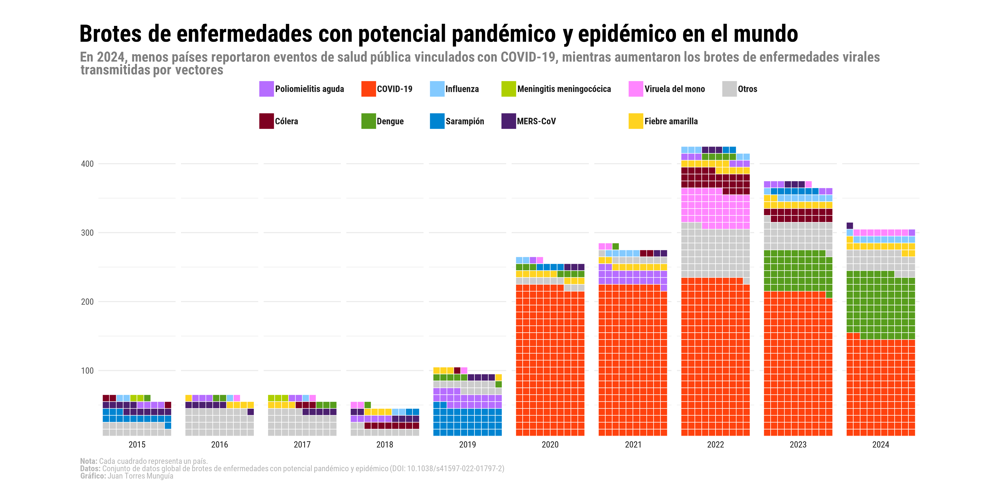

## Descripción general
En estas notas, se muestra cómo usar {ggplot} para crear un gráfico de waffle sobre la frecuencia de brotes de enfermedades en el mundo. El resultado final se verá así:

{.lightbox width=100% style="margin-top: 0px; margin-bottom: 0px;"}

## Acerca de los datos
La fuente de información es la base de datos global de brotes de enfermedades con potencial pandémico y epidémico, cuyos datos están disponibles de forma gratuita en el <a href="https://github.com/jatorresmunguia/disease_outbreak_news" target="_blank">repositorio de GitHub</a> del **proyecto de brotes de enfermedades**.  

La unidad de análisis en la base de datos es un brote, definido como la ocurrencia de al menos un caso de una enfermedad específica en un país -o territorio- durante un año particular. Por lo tanto, un país -o territorio- no puede tener más de un brote de la misma enfermedad en el mismo año, aunque sí puede experimentar brotes de diferentes enfermedades dentro del mismo año. Un país solo puede tener múltiples brotes de la misma enfermedad si ocurren en años diferentes.

La base de datos incluye información sobre más de 3,000 brotes de enfermedades con potencial pandémico y epidémico asociados a más de 80 enfermedades infecciosas diferentes, ocurridos a nivel mundial desde enero de 1996 hasta la fecha. Las enfermedades están clasificadas según la Clasificación Internacional de Enfermedades, 10.ª Revisión (CIE-10), y la base de datos contiene información sobre el año, país y enfermedad de cada brote.

La base de datos de brotes de enfermedades con potencial pandémico y epidémico también forma parte del [Humanitarian Data Exchange](https://data.humdata.org/) coordinado por la Oficina de Coordinación de Asuntos Humanitarios de las Naciones Unidas (OCHA).

## Preparación 
Para crear el gráfico de waffle, utilizaremos los siguientes paquetes de R:

```{r}
#| warning: false

library(tidyverse) # Formato de análisis de datos tidy
library(readxl) # Leer archivos de Excel
library(httr) # Realizar solicitudes HTTP
library(showtext) # Añadir fuentes personalizadas a los gráficos
library(ggtext) # Añadir texto enriquecido a los gráficos
library(waffle) #  Crear gráficos de waffle
```

## Cargando datos desde GitHub
La base de datos está almacenada en un archivo Excel. Se descarga desde [GitHub](https://github.com/jatorresmunguia/disease_outbreak_news/raw/refs/heads/main/Humanitarian%20Data%20Exchange/data_2_share/disease_outbreaks_HDX.xlsx) y se carga en R:

```{r}
#| warning: false

# Definir la URL del contenido raw de GitHub
link_data <- "https://github.com/jatorresmunguia/disease_outbreak_news/raw/refs/heads/main/Humanitarian%20Data%20Exchange/data_2_share/disease_outbreaks_HDX.xlsx"

# Crear un archivo temporal para almacenar los datos
temp <- tempfile(fileext = ".xlsx")

# Descargar los datos desde GitHub usando autenticación
get_req <- GET(
  link_data,
  authenticate(Sys.getenv("GITHUB_PAT"), ""),
  write_disk(path = temp)
)

# Leer el archivo Excel en R
outbreaks <- read_excel(temp)
```

### Procesamiento de datos
Agruparemos los datos por año y enfermedad, y luego filtraremos las 10 enfermedades principales de 1996 a 2024. También agruparemos los datos por año y enfermedad, y luego filtraremos las 10 enfermedades principales de 2015 a 2024. Finalmente, crearemos una variable factor para las 10 enfermedades principales y la categoría "Otros".
```{r}
#| warning: false

# Top 10 enfermedades 1996-2024
top_10_icd104n <- outbreaks |>
  filter(Year < 2025) |>
  group_by(icd104n) |>
  summarise(freq = n(), .groups = "drop") |>
  arrange(-freq) |>
  slice_head(n = 10)

# Solo categorías top-10 y Otros
outbreaks_year_disease_grouped <- outbreaks |>
  filter(Year < 2025 & Year > 2014) |>
  mutate(icd104n = ifelse(icd104n %in% top_10_icd104n$icd104n, icd104n, "Otros")) |> # Agrupar las enfermedades
  group_by(Year, icd104n) |>
  summarise(freq = n(), .groups = "drop") |> # Contar el número de brotes
  arrange(-freq)

# Crear variable factor para las 10 enfermedades principales y la categoría "Otros"
outbreaks_year_disease_grouped <- outbreaks_year_disease_grouped |>
  mutate(icd104n = factor(icd104n,
    levels = c(
      "Acute poliomyelitis, unspecified", "Classical cholera", "COVID-19, virus identified",
      "Dengue, unspecified", "Influenza due to identified zoonotic or pandemic influenza virus", "Measles",
      "Meningococcal meningitis", "Middle East respiratory syndrome coronavirus [MERS-CoV]", "Monkeypox",
      "Yellow fever, unspecified", "Otros"
    ),
    labels = c(
      "Poliomielitis aguda", "Cólera", "COVID-19", "Dengue", "Influenza",
      "Sarampión", "Meningitis meningocócica", "MERS-CoV", "Viruela del mono",
      "Fiebre amarilla", "Otros"
    )
  ))
```

## Establece el tema y define fuentes, colores y texto a ser usado en la gráfica
```{r}
#| warning: false

# Agregar fuente personalizada
font_add_google("Roboto Condensed", "Roboto Condensed") 

showtext_auto()

# Tema personalizado para el gráfico de waffle
theme_waffle_chart <- function() {
  theme_minimal(
    base_family = "Roboto Condensed" # Tema base con fuente personalizada
  ) +
    # Configuración del tema
    theme(
      # Configuración de los ejes
      axis.title = element_blank(), # Quitar títulos de los ejes
      axis.line = element_blank(), # Quitar línea de los ejes
      
      # Configuración del título
      plot.title.position = "plot", # Posición del título
      plot.title = element_textbox(
        color = "black",
        face = "bold",
        size = 24,
        margin = margin(5, 0, 5, 0), # Top, right, bottom, left
        width = unit(1, "npc") # Ancho del título, npc == 1 corresponde al ancho total del gráfico
      ),
      
      # Configuración del subtítulo
      plot.subtitle = element_textbox(
        color = "grey50",
        face = "bold",
        size = 14,
        margin = margin(0, 0, 10, 0),
        width = unit(1, "npc")
      ),
      
      # Configuración de la leyenda
      legend.position = "top",
      legend.title = element_blank(),
      legend.spacing.x = unit(0.2, "cm"),
      legend.key.spacing = unit(0.5, "cm"), # Espacio entre claves de la leyenda
      legend.text = element_text(
        margin = margin(5, 2, 5, 0),
        face = "bold",
        color = "grey10",
        size = 9
      ),
      legend.direction = "horizontal",
      legend.byrow = FALSE,
      
      # Configuración del pie de gráfico
      plot.caption = element_markdown(
        color = "grey70",
        size = 8,
        hjust = 0
          ),
      plot.caption.position = "plot",

      plot.background = element_rect(
        color = "white",
        fill = "white"
      ),
      plot.margin = margin(20, 40, 20, 40)
    )
}

# Título, subtítulo y pie de gráfico para el gráfico de waffle
title_chart <- "Brotes de enfermedades con potencial pandémico y epidémico en el mundo"
subtitle_chart <- "En 2024, menos países reportaron eventos de salud pública vinculados con COVID-19, mientras aumentaron los brotes de enfermedades virales transmitidas por vectores"
caption_chart <- paste0("**Nota:** Cada cuadrado representa un país.",
                        "<br>", 
                        "**Datos:** Conjunto de datos global de brotes de enfermedades con potencial pandémico y epidémico (DOI: 10.1038/s41597-022-01797-2)",
                        "<br>", 
                        "**Gráfico:** Juan Torres Munguía"
                        )

# Definir los colores a utilizar en el gráfico de waffle
colors <- c(
  "#B66DFF", "#7e0021", "#ff420e", "#579d1c", "#83caff",
  "#0084d1", "#aecf00", "#4b1f6f", "#FF86FF", "#ffd320", "grey80"
  )

```

## Crear gráfica de waffle
```{r}
#| warning: false
#| output: false

ggplot(
  outbreaks_year_disease_grouped,
  aes(fill = icd104n, values = freq)
) +
  geom_waffle(
    size = 0.25, # Tamaño de los cuadrados del waffle
    n_rows = 10, # Número de filas en el gráfico de waffle
    flip = TRUE, # Voltear el gráfico de waffle
    color = "white", # Color del borde de los cuadrados
    make_proportional = FALSE
  ) + # No hacer proporcional el gráfico de waffle
  facet_wrap(~Year, # Dividir el gráfico por año
             nrow = 1,
             strip.position = "bottom"
  ) + # Posición de la etiqueta de faceta
  scale_fill_manual(values = colors) +
  scale_x_discrete() +
  scale_y_continuous(
    labels = function(x) x * 10,
    expand = c(0, 0)
  ) + # Expandir el eje y
  coord_equal() +
  labs(
    title = title_chart,
    subtitle = subtitle_chart,
    caption = caption_chart,
    x = "",
    y = "Número total de brotes",
    fill = ""
  ) +
  guides(fill = guide_legend(nrow = 2 # Número de filas en la leyenda
                             )) + 
  theme_waffle_chart()

```

## Guardar la gráfica en formato PNG
```{r}
#| warning: false

showtext_opts(dpi = 320) # Resolución de 320 ("retina")
ggsave(
  "waffle-pandemics.png",
  dpi = 320,
  width = 14,
  height = 7,
  units = "in"
)
showtext_auto(FALSE)
```
