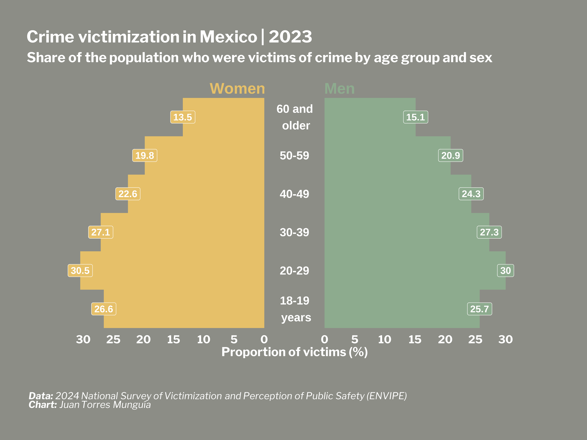

## Overview
Population pyramids are a powerful way to visualize demographic data, especially when analyzing age and sex patterns. In this post, I will elaborate a population pyramid using the {ggplot2} package in R, specifically focusing on crime victimization data from Mexico's National Survey of Victimization and Perception of Public Safety (_Encuesta Nacional de Victimización y Percepción sobre Seguridad Pública_, ENVIPE).

## Set-up
First, we need to install and load the necessary R packages. 
```{r}
#| warning: false

library(tidyverse) # I always load tidyverse for data manipulation
library(ggplot2) # For data visualization
library(ggtext) # For formatting text in ggplot2
library(showtext) # For custom fonts in ggplot2
library(readxl) # For reading Excel files
library(kableExtra) # For data tables

```

## Loading data
I will use the data from the table **Population aged 18 and over by state, age group, sex and victimization condition** (_Población de 18 años y más por entidad federativa y grupos de edad según sexo y condición de victimización_) from the 2024 ENVIPE available [here](https://www.inegi.org.mx/programas/envipe/2024/#tabulados). 

```{r}
#| warning: false
envipe_data <- read.csv("victimization-age-sex-Mexico.csv")

```

Data looks like this:

```{r}
#| warning: false
envipe_data |>
  kbl(caption = "Prevalence of victimization by age and sex in Mexico, 2023") |>
  kable_paper("hover", full_width = F)

```

Then, we use the {tidyverse} package to prepare the data for plotting. 
```{r}
#| warning: false

envipe_data <- envipe_data |>
  mutate(Prevalence = case_when(Sex == "Women" ~ -1*Prevalence - 5,
                                TRUE ~ Prevalence + 5)) |>
  mutate(Age = factor(Age, levels = c("18-19", "20-29", "30-39", "40-49", "50-59", "+60"))) 

```

## Creating the population pyramid
First, we estimate the adjusted limits for the x-axis.
```{r}
#| warning: false

prevalence_breaks <- seq(0, 30, by = 5)
# We add 5 to create a gap in the center of the plot
prevalence_breaks_adjusted <- c(prevalence_breaks + 5, -1*prevalence_breaks - 5)

```

Then, I create a custom theme for the chart and set the font to "Libre Franklin" using the `showtext` package. More font options are available [https://fonts.google.com/](https://fonts.google.com/).
```{r}
#| warning: false
#| output: false

font_add_google("Libre Franklin", "Libre Franklin")

showtext_auto()

# Custom theme for the chart
theme_pyramid_chart <- function() {
  theme_minimal(
    base_family = "Libre Franklin" 
  ) +
    # Custom theme settings
    theme(
      # remove grid lines
      panel.grid = element_blank(),

      # Axis settings
      axis.title.y = element_blank(),
      axis.text.y = element_blank(),
      axis.title.x = element_text(
        color = "white",
        face = "bold",
        size = 18
      ),
      axis.text.x = element_text(
        color = "white",
        face = "bold",
        size = 16
      ),

      # Title settings
      plot.title.position = "plot", 
      plot.title = element_textbox(
        color = "white",
        face = "bold",
        size = 24,
        margin = margin(5, 0, 5, 0), # top, right, bottom, left
        width = unit(1, "npc") 
      ),

      plot.subtitle = element_textbox(
      color = "white",
      face = "bold",
      size = 20,
      margin = margin(5, 0, 35, 0),
      width = unit(1, "npc")
    ),

      # Legend settings
      legend.position = "none",

      # Caption settings
      plot.caption = element_markdown(
        color = "white",
        face = "italic",
        size = 14,
        hjust = 0,
        margin = margin(50, 0, 5, 0) # top, right, bottom, left
        ),
      plot.background = element_rect(
        color = "#8C8D86",
        fill = "#8C8D86"
      ),
      plot.margin = margin(40, 40, 40, 40) # top, right, bottom, left
    )
}

title_chart <- "Crime victimization in Mexico | 2023"
subtitle_chart <- "Share of the population who were victims of crime by age group and sex"
caption_chart <- paste0("**Data:** 2024 National Survey of Victimization and Perception of Public Safety (ENVIPE)",
                        "<br>", 
                        "**Chart:** Juan Torres Munguía")

```

Finally, I use `geom_col()`, `geom_label()`, and `annotate()` from the {ggplot2} package to design the chart. 
```{r}
#| warning: false
#| output: false

envipe_data |> 
  ggplot(aes(x = Age, 
             y = Prevalence, 
             fill = Sex)
        ) +
  geom_col(width = 1) +
  scale_fill_manual(
    values = c("Women" = "#E6C069", 
               "Men" = "#8DAB8E")) + 
  geom_label(
    aes(label = round(
      abs(Prevalence)-5, 1 # Round the figure 
      ), 
        y = Prevalence),
        color = "white",
        size = 5,
        fontface = "bold"
        ) +
  coord_flip(clip = "off") + 
  annotate(
    geom = "text",
    x = 6.75, 
    y = 7.5, 
    label = "Men",
    size = 8, 
    color = "#8DAB8E",
    fontface = "bold") +
  # Adding annotations for the sex of the victim
  annotate(
    geom = "text",
    x = 6.75, 
    y = -9.5, 
    label = "Women",
    size = 8, 
    color = "#E6C069",
    fontface = "bold") +
  # Adding a rectangle at the center of the plot
  # This rectangle will containg the x-axis labels (plot is inverted)
  # and is included between -5 and 5 values of the y-axis (plot is inverted)
  annotate(
    geom = "rect", 
    xmin = -Inf, 
    xmax = Inf, 
    ymin = 5, 
    ymax = -5,
    fill = "#8C8D86") + 
  # Labels for the vertical axis (age groups)
  annotate(
    geom = "text",
    x = c("18-19", "20-29", "30-39", "40-49", "50-59", "+60"), 
    y = 0, 
    label = c("18-19 \n years", "20-29", "30-39", "40-49", "50-59", "60 and \n older"),
    size = 6, 
    color = "white",
    fontface = "bold") +
  # I manually added a -40, 40 range of values to include the space in the center
  scale_y_continuous(
    limits = c(-40, 40),
    breaks = prevalence_breaks_adjusted,
    # Labels are renamed to be linked to real values of the x-axis, removing the 
    # space in the center
    labels = function(x) {abs(x) - 5}) + 
  labs(
    title = title_chart,
    subtitle = subtitle_chart,
    caption = caption_chart,
    x = "",
    y = "Proportion of victims (%)",
    fill = "") +
  theme_pyramid_chart()

# Set the resolution of the image 320 dpi is for high-quality images ("retina")
showtext_opts(dpi = 320) 
ggsave(
  "pyramid-crime-mexico.png",
  dpi = 320,
  width = 12,
  height = 9,
  units = "in"
)
showtext_auto(FALSE) # Turn off the showtext functionality

```

{width=100% style="margin-top: 0px; margin-bottom: 0px;" .lightbox}