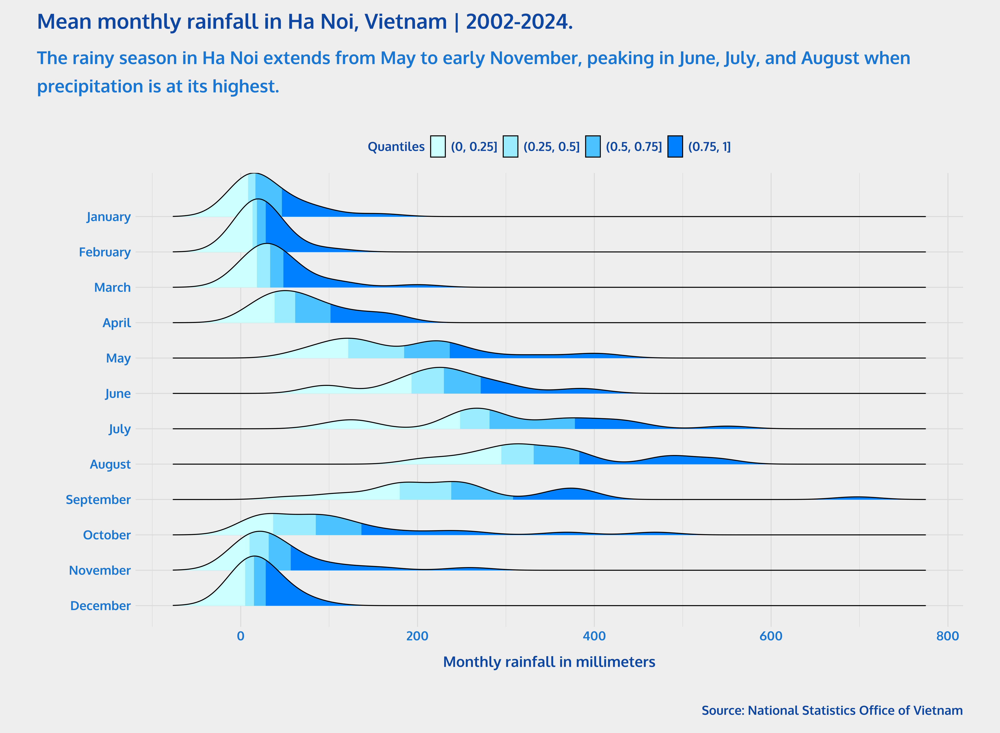
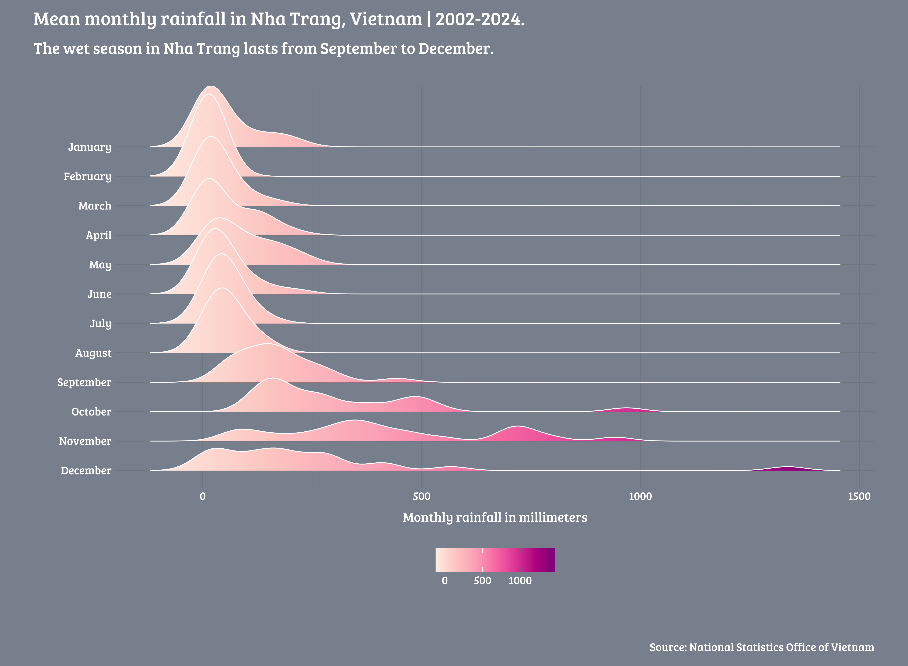

## Overview
Ridgeline plots are a type of chart that displays the distribution of a numeric variable for different categories. These plots are commonly used to visualize changes in distributions over time. To showcase how to create ridgeline plots with {ggplot2} and {ggridges} in R, I will use data on monthly rainfall at some stations by provincies and month in Vietnam, from 2002 to 2024.

## Set-up
First, we install and load the necessary R packages. 

```{r}
#| warning: false

library(tidyverse) 
library(readxl) # To read Excel files
library(kableExtra) # For data tables
library(lubridate)
library(ggplot2)
library(ggridges) # To create ridgeline plots
library(ggtext) 
library(showtext) 

```

## About the data
Data come from the National Statistics Office of Vietnam and is available at their [website](https://www.nso.gov.vn/en/px-web/?pxid=E0109&theme=Administrative%20Unit%20and%20Climate). I downloaded the data and saved it in an Excel file called `rainfall-vietnam.xlsx`. 

```{r}
#| warning: false

rainfall_vietnam <- read_excel("rainfall-vietnam.xlsx")

```

Data is not in a tidy format, so I will need to wrangle it. 

```{r}
#| warning: false

rainfall_vietnam <- rainfall_vietnam |>
  rename(year = `Monthly rainfall at some stations by Year, Cities, provincies and Month`,
         city = `...2`) |>
  fill(year) |>    # `fill()` replaces missing data from top to bottom
  rename_at(vars(`...3`:`...14`), 
            ~ month.name
            ) |> # row 2 contains the name of the months
  slice(-c(1:2)) |> # remove first two rows
  mutate_at(vars(January:December), 
           ~ as.numeric(.)) |>
  pivot_longer(cols = January:December, 
               names_to = "month",
               values_to = "rainfall") 

```

This information looks like this:
```{r}
#| warning: false

rainfall_vietnam |>
  head(15) |>
  kbl(
    caption = "Monthly rainfall by month in Vietnam, 2002-2024"
    ) |>
  kable_paper("hover", full_width = F)

```

## Creating the ridgeline plots
I will create three versions of the ridgeline plot. First, the ridgeline plot will show the interquantile range of rainfall by month in Ha Noi. Here, the colors represent different quantiles of the distribution of rainfall per month. To show this, I will plot the data from [Ha Noi](https://en.wikipedia.org/wiki/Hanoi), capital of Vietnam.
```{r}
#| warning: false
#| output: false

rainfall_vietnam <- rainfall_vietnam |>
  mutate(month = factor(month, levels = month.name)) # Important to order months in the correct order

# More font alternatives can be found here https://fonts.google.com/
font_add_google("Oxygen", "Oxygen") 

showtext_auto()

rainfall_vietnam |>
  filter(city == "Ha Noi") |>
ggplot(aes(x = rainfall, 
           y = reorder(month, desc(month)), 
           fill = after_stat(quantile)
           )) + 
    stat_density_ridges(quantile_lines = FALSE, 
                        geom = "density_ridges_gradient",
                        calc_ecdf = TRUE,
                        color = "black",
                        scale = 1.5) + # Height of ridges
    scale_fill_manual(
      name = "Quantiles",
      values = c("#CCFFFF", "#99EDFF", "#4CC3FF", "#007FFF"),
      labels = c("(0, 0.25]", "(0.25, 0.5]", "(0.5, 0.75]", "(0.75, 1]")
      ) +
  ggtitle("Mean monthly rainfall in Ha Noi, Vietnam | 2002-2024.",
          subtitle = str_wrap("The rainy season in Ha Noi extends from May to early November, peaking in June, July, and August when precipitation is at its highest.", width = 110)
          ) +
  xlab("Monthly rainfall in millimeters") + 
  ylab("") +
  labs(caption = "Source: National Statistics Office of Vietnam") +
  theme_minimal(
    base_family = "Oxygen",
    paper = "#EEEEEE"
    ) +
  theme(

    plot.margin = margin(0, 40, 0, 40),

    plot.title = element_text(
      color = "#0D47A1",
      face = "bold",
      size = 100,
      hjust = 0,
      margin = margin(15, 0, 0, 0)
    ), 
    plot.title.position = "plot",

    plot.subtitle = element_text(
      color = "#1976D2",
      face = "bold",
      size = 85,
      hjust = 0,
      margin = margin(0, 0, 20, 0),
      lineheight = 0.3
    ),

    axis.title = element_text(
      color = "#0D47A1",
      face = "bold",
      size = 70
    ), 
    axis.text = element_text(
      color = "#1976D2",
      face = "bold",
      size = 60
    ), 

    plot.caption = element_text(
      color = "#0D47A1",
      face = "bold",
      size = 60,
      hjust = 1,
      margin = margin(25, 0, 5, 0)
    ),

    legend.position = "top",
    legend.title = element_text(
      face = "bold",
      color = "#0D47A1",
      size = 60,
      hjust = 1
    ),
    legend.text = element_text(
      face = "bold",
      color = "#0D47A1",
      size = 60,
      hjust = 1
    ),

  )

# showtext_opts(dpi = 320) 
# ggsave(
#  "rainfall-vietnam-ridgeline.png",
#  dpi = 320,
#  width = 15,
#  height = 11,
#  units = "in"
# )
# showtext_auto(FALSE)

```

{width=100% style="margin-top: 0px; margin-bottom: 0px;".lightbox}

In the second version of the ridgeline plot, I will use a gradient with a continuous fill color scale to represent the amount of rainfall. I will also use other font and color choices. To show this, I will plot the data from [Nha Trang](https://en.wikipedia.org/wiki/Nha_Trang), a coastal city and the capital of Khánh Hòa Province.

```{r}
#| warning: false
#| output: false

# More font alternatives can be found here https://fonts.google.com/
font_add_google("Bree Serif", "Bree Serif") 

showtext_auto()

rainfall_vietnam |>
  filter(city == "Nha Trang") |>
ggplot(aes(x = rainfall, 
           y = reorder(month, desc(month)), 
           fill = stat(x)
           )) + 
    stat_density_ridges(quantile_lines = FALSE, 
                        geom = "density_ridges_gradient",
                        color = "white",
                        scale = 2.8) + # Height of ridges
    scale_fill_distiller(
      direction = 1,
      name = "",
      palette = "RdPu"
      ) +
  ggtitle("Mean monthly rainfall in Nha Trang, Vietnam | 2002-2024.",
          subtitle = str_wrap("The wet season in Nha Trang lasts from September to December.", width = 110)
          ) +
  xlab("Monthly rainfall in millimeters") + 
  ylab("") +
  labs(caption = "Source: National Statistics Office of Vietnam") +
  theme_minimal(
    base_family = "Bree Serif",
    paper = "#767F8B"
    ) +
  theme(

    plot.margin = margin(0, 40, 0, 40),

    plot.title = element_text(
      color = "white",
      face = "bold",
      size = 100,
      hjust = 0,
      margin = margin(15, 0, 0, 0)
    ), 
    plot.title.position = "plot",

    plot.subtitle = element_text(
      color = "white",
      face = "bold",
      size = 85,
      hjust = 0,
      margin = margin(0, 0, 20, 0),
      lineheight = 0.3
    ),

    axis.title = element_text(
      color = "white",
      face = "bold",
      size = 70
    ), 
    axis.text = element_text(
      color = "white",
      face = "bold",
      size = 60
    ), 

    plot.caption = element_text(
      color = "white",
      face = "bold",
      size = 60,
      hjust = 1,
      margin = margin(25, 0, 5, 0)
    ),

    legend.position = "bottom",
    legend.title.position = "bottom",
    legend.key.size = unit(1, "cm"),
    legend.title = element_text(
      face = "bold",
      color = "white",
      size = 60,
      hjust = 0.5
    ),
    legend.text = element_text(
      face = "bold",
      color = "white",
      size = 60,
      hjust = 0.5
    ),

  )

# showtext_opts(dpi = 320) 
# ggsave(
#  "rainfall-vietnam-ridgeline_gradient.png",
#  dpi = 320,
#  width = 15,
#  height = 11,
#  units = "in"
# )
# showtext_auto(FALSE)

```

{width=100% style="margin-top: 0px; margin-bottom: 0px;".lightbox}
