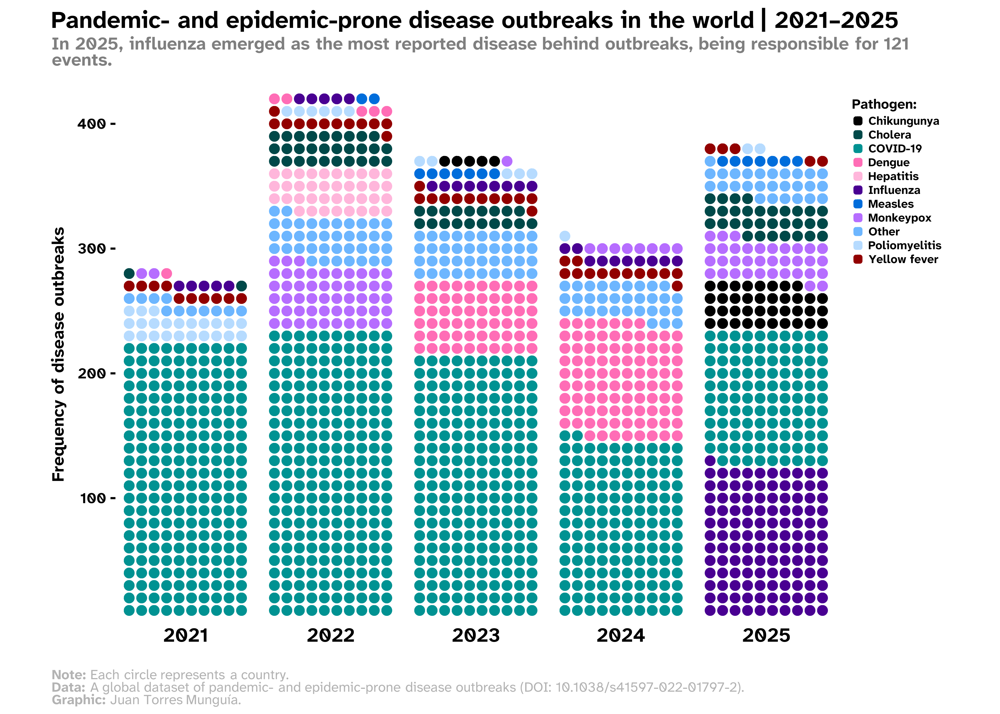

## Overview
Waffle charts are a useful way to visualize part-to-whole relationships. Commonly, waffle charts depict a grid of regular squares to represent the distribution of a categorical variable.

Previously, in a [post on this Blog](/blog/posts/waffle-chart-disease-outbreaks/index.qmd) [@TorresMunguia.2025], I built the following waffle chart to visualize disease outbreaks in the world between 2015 and 2024.

{.lightbox width=100% style="margin-top: 0px; margin-bottom: 0px;"}

This visualization was developed in support of an analysis paper published in BMJ Global Health, which can be accessed [here](https://gh.bmj.com/content/11/2/e020708) [@TorresMunguia.2026]. As can be seen, this waffle chart uses the traditional approach of stacking colored squares to represent the number of outbreaks per year by pathogen. In this post, I will illustrate a visual alternative in which circles are used instead of squares to represent the distribution of diseases by year.

## About the data
The information is sourced from the [global dataset of pandemic- and epidemic-prone disease outbreaks](https://www.nature.com/articles/s41597-022-01797-2) [@TorresMunguia.2022], whose data are freely available at the <a href="https://github.com/jatorresmunguia/disease_outbreak_news" target="_blank">GitHub repository</a> of the disease outbreaks project. 

This global dataset documents more than 3,450 outbreaks across over 230 countries and territories from January 1996 to January 2026. The diseases are classified according to the International Classification of Diseases, 10th Revision (ICD-10), and the dataset contains information on the year, country, and pathogen for each outbreak.

The dataset of pandemic- and epidemic-prone disease outbreaks is also part of the [Humanitarian Data Exchange](https://data.humdata.org/) coordinated by the United Nations Office for the Coordination of Humanitarian Affairs (OCHA).

## Set-up
To create the waffle chart, we will use the following R packages:

```{r}
#| warning: false

# Data manipulation
library(tidyverse)

# Waffle chart
library(waffle)

# Visualization extensions for ggplot2
library(paletteer)
library(ggsci)
library(ggtext) 
library(shadowtext)
library(showtext)

# Create styled HTML/LaTeX tables
library(kableExtra)  

```

## Loading data
The table with the organized data can be downloaded here. This table contains the outbreaks recorded by year and by disease worldwide. The dataset is stored in a `.csv` file and is ready to be downloaded from [here](blog/posts/waffle-chart-disease-outbreaks-2025/outbreaks_year_disease_grouped.csv). 

```{r}
#| warning: false
outbreaks_year_disease_grouped <- read.csv("outbreaks_year_disease_grouped.csv")

```

This table is shown below:

```{r}

outbreaks_year_disease_grouped |>
  arrange(Year, -freq) |>
  kbl(caption = "Disease outbreaks per disease and year") |>
  kable_paper("hover", full_width = F)

```

## Step 1. Visual elements of the plot
First, I define the font to be used in the final chart. To do this, I commonly use the `font_add_google()` function from the `showtext` package. package. This function retrieves font families from the [Google Fonts repository](https://fonts.google.com/). In this example, I use the _Atkinson Hyperlegible Next_ font. 

```{r}
#| warning: false

# Add custom font
font_add_google("Atkinson Hyperlegible Next", "Atkinson Hyperlegible Next") 
showtext_auto()

```

Then, I customize a theme to be applied to the plot.

```{r}

# Custom theme for the waffle chart
theme_waffle_chart <- function() {

  # Introduce the previously selected font
  theme_minimal(base_family = "Atkinson Hyperlegible Next") +

  # Custom theme settings
  theme(
    # Axis settings
    axis.title = element_blank(), # Remove axis titles
    axis.line = element_blank(), # Remove axis lines
      
    # Title settings
    plot.title.position = "plot", # Position of the title
    plot.title = element_textbox(
      color = "black",
      face = "bold",
      size = 24,
      margin = margin(5, 0, 5, 0), # Top, right, bottom, left margins
      width = unit(1, "npc") # Full plot width
    ),

    plot.margin = unit(c(0.25, 0.25, 0.25, 0.25), "cm"),

    # Legend 
    legend.justification = c(1, 1),
    legend.title = element_text(face = "bold", size = 14),
    legend.title.position = "top",
    legend.text = element_text(face = "bold", size = 12),
    legend.direction = "vertical",
    legend.spacing.x = unit(30, "pt"),
    legend.key.size = unit(11, "pt"),
    legend.key.spacing.y = unit(3, "pt"),
    legend.key.spacing.x = unit(10, "pt"),

    # Subtitle settings
    plot.subtitle = element_textbox(
      color = "grey50",
      face = "bold",
      size = 18,
      margin = margin(0, 0, 40, 0), # Top, right, bottom, left margins
      width = unit(1, "npc")
    ),

    # Caption settings
    plot.caption = element_textbox(
      color = "grey70",
      size = 14,
      hjust = 0
    ),
    plot.caption.position = "plot",

    # Background and margins
    plot.background = element_rect(
      color = "white",
      fill = "white"
    ),
    panel.grid = element_blank(), 
    strip.text.x = element_text(face = "bold", margin = margin(t = 10), color = "black", size = 20),

    # Axis
    axis.ticks.y = element_line(linewidth = 1),
    axis.ticks.length.y = unit(5, "pt"),
    axis.text.x = element_text(face = "bold", color = "black", size = 12),
    axis.text.y = element_text(face = "bold", color = "black", size = 15),
    axis.title.x = element_text(face = "bold", margin = margin(t = 10), color = "black", size = 13),
    axis.title.y = element_text(face = "bold", margin = margin(r = 10), color = "black", size = 17)
    )
}

```

Then, I define the title, subtitle, and caption of the plot.
```{r}

# Title, subtitle, and caption for the waffle chart
title_chart <- "Pandemic- and epidemic-prone disease outbreaks in the world | 2021–2025"
subtitle_chart <- "In 2025, influenza emerged as the most reported disease behind outbreaks, being responsible for 121 events."

```

For the caption, I use rich text by introducing markdown to format specific elements. This is enabled through the `ggtext` package.
```{r}

caption_chart <- paste0(
  "**Note:** Each circle represents a country.",
  "<br>", 
  "**Data:** A global dataset of pandemic- and epidemic-prone disease outbreaks (DOI: 10.1038/s41597-022-01797-2).",
  "<br>", 
  "**Graphic:** Juan Torres Munguía."
  )

```

## Step 2. Designing the waffle plot using `ggplot2` package
First, I use the `geom_waffle()` function to construct the waffle chart with squares. The main arguments of this function include _size_ (border size of the tiles), *n_rows* (number of rows in the waffle grid), *flip* (orientation of the tiles), *color* (border color), and *make_proportional* (whether values are rescaled to proportions).

Additionally, to 
```{r}
#| warning: false
#| output: false

ggplot(outbreaks_year_disease_grouped, 
      aes(fill = icd104n, values = freq)) +
  geom_waffle(size = 0.75, 
              n_rows = 10, 
              flip = TRUE,
              color = "white", 
              make_proportional = FALSE) +
  facet_wrap(~Year, 
             nrow = 1, 
             strip.position = "bottom")

```

In this example, I use the set of colors from the _paletteMartin_ palette of the `colorBlindness` package. I also add the custom `theme()` along with the title, subtitle, and caption elements.

```{r}
#| warning: false
#| output: false

ggplot(outbreaks_year_disease_grouped, 
                aes(fill = icd104n, values = freq)) +
  geom_waffle(size = 0.75, 
              n_rows = 10, 
              flip = TRUE,
              color = "white", 
              make_proportional = FALSE) +
  facet_wrap(~Year, 
             nrow = 1, 
             strip.position = "bottom") +
  scale_fill_manual(values = c(paletteer_d("colorBlindness::paletteMartin"))) +
  scale_x_discrete() +
  scale_y_continuous(labels = function(x) x * 10, 
                     expand = c(0, 0)) +
  coord_equal() +
  labs(
    title = title_chart,
    subtitle = subtitle_chart,
    caption = caption_chart,
    x = "", 
    y = "Frequency of disease outbreaks",
    fill = "Pathogen:") +
  guides(fill = guide_legend(position = "right")) +
  theme_waffle_chart()

```

## Step 3. Transforming the squares into circles.
Finally, to transform the tiles from squares into circles, I use *radius* as an aesthetic inside `aes()`, assigning the value *grid::unit(0.5, "npc")*. This produces circular tiles while preserving the waffle layout structure.

```{r}
#| warning: false
#| output: false

ggplot(outbreaks_year_disease_grouped, 
                aes(fill = icd104n, values = freq)) +
  geom_waffle(radius = grid::unit(0.5, "npc"),
              size = 0.75, 
              n_rows = 10, 
              flip = TRUE,
              color = "white", 
              make_proportional = FALSE) +
  facet_wrap(~Year, 
             nrow = 1, 
             strip.position = "bottom") +
  scale_fill_manual(values = c(paletteer_d("colorBlindness::paletteMartin"))) +
  scale_x_discrete() +
  scale_y_continuous(labels = function(x) x * 10, 
                     expand = c(0, 0)) +
  coord_equal() +
  labs(
    title = title_chart,
    subtitle = subtitle_chart,
    caption = caption_chart,
    x = "", 
    y = "Frequency of disease outbreaks",
    fill = "Pathogen:") +
  guides(fill = guide_legend(position = "right")) +
  theme_waffle_chart()

```

## Step 4. Save the waffle chart as a high-quality image
```{r}
#| warning: false

showtext_opts(dpi = 320) # Resolution of 320 dpi for high-quality images ("retina")
ggsave(
  "waffle-pandemics-2026.png",
  dpi = 320,
  width = 14,
  height = 10,
  units = "in"
)
showtext_auto(FALSE)
```

{.lightbox width=100% style="margin-top: 0px; margin-bottom: 0px;"}

### References
::: {#refs}
:::