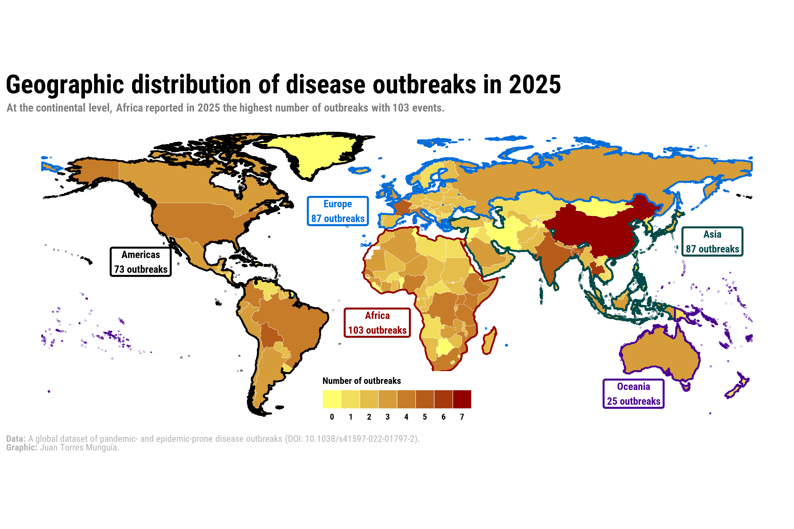

## Overview
Recently, I built a visualization as part of a paper published in BMJ Global Health, which can be accessedd [here](https://gh.bmj.com/content/11/2/e020708) [@TorresMunguia.2026]. The goal of this map was to communicate the geographic distribution of disease outbreaks worldwide during 2025. Additionally, I aimed to provide complementary information on the frequency of events at the continental level (suggested during the review process). In this blog post, I describe the process of reproducing this plot using {ggplot} and {sf} in R.

## About the data
The statistical information is sourced from the [global dataset of pandemic- and epidemic-prone disease outbreaks](https://www.nature.com/articles/s41597-022-01797-2) [@TorresMunguia.2022], whose data are freely available at the <a href="https://github.com/jatorresmunguia/disease_outbreak_news" target="_blank">GitHub repository</a> of the disease outbreaks project. 

This global dataset documents over 3,450 outbreaks across more than 230 countries and territories from January 1996 to January 2026. The diseases are classified according to the International Classification of Diseases and the dataset contains information on the year, country, and pathogen for each outbreak.

The dataset of pandemic- and epidemic-prone disease outbreaks is also part of the [Humanitarian Data Exchange](https://data.humdata.org/) coordinated by the United Nations Office for the Coordination of Humanitarian Affairs (OCHA).

## Set-up
To create the map of the World, we will use the following R packages:

```{r}

# Data manipulation
library(tidyverse)
library(janitor)

# Spatial data handling
library(sf) # Handle spatial vector data
library(rnaturalearth) # Access Natural Earth map data
library(rnaturalearthdata) # Support data for rnaturalearth

# Visualization
library(ggplot2)
library(ggspatial) # Spatial annotations for ggplot2
library(ggsflabel) # Labeling for sf objects
library(paletteer) # Access multiple color palettes
library(ggsci) # Scientific journal palettes
library(ggtext) # Rich text elements in ggplot
library(shadowtext) # Text with outline/shadow
library(showtext) # Custom fonts in plots
library(ggpubr) # Plot arrangement and publication utilities

# Tables
library(kableExtra) # Styled HTML/LaTeX tables

```

## Loading data
The table with the organized data can be downloaded [here](outbreaks_2025.csv). This table contains the outbreaks registered during 2025 by country and disease.

```{r}

outbreaks_2025 <- read.csv("outbreaks_2025.csv")

```

The first five observations of the dataset are shown below:

```{r}

outbreaks_2025 |>
 slice_head(n = 5) |>
 kbl(caption = "Disease outbreaks during 2025") |>
 kable_paper("hover", full_width = F)

```

## Step 1. Data wrangling
First, it is necessary to reshape the `outbreaks_2025` dataset to obtain the total number of outbreaks by country.

```{r}
outbreaks_2025_country <- outbreaks_2025 |> 
 group_by(Country, iso3) |> 
 reframe(freq = n()) |> 
 ungroup() |> 
 arrange(-freq)

```

The first five observations of the table with outbreaks per country are:

```{r}
outbreaks_2025_country |>
 slice_head(n = 5) |>
 kbl(caption = "Disease outbreaks by country during 2025") |>
 kable_paper("hover", full_width = F)
```

I also compute the total number of outbreaks by continent.

```{r}

outbreaks_2025_continent <- outbreaks_2025 |> 
 group_by(unsd_region) |>
 reframe(freq = n()) |>
 ungroup() |>
 arrange(-freq) |>
 rename(continent = unsd_region)

```

Here is the information at the continental level:

```{r}
outbreaks_2025_continent |>
 kbl(caption = "Disease outbreaks by continent during 2025") |>
 kable_paper("hover", full_width = F)
```

## Step 2. Geographic information

To create the map with geographic boundaries, I use a shapefile located [here](shp/shp_outbreaks.shp). This file is imported with the `st_read()` function from the `sf` package.

```{r}

shpsf <- st_read("shp/shp_outbreaks.shp", quiet = TRUE)
shpsf <- shpsf |> 
  filter(!is.na(continent))

# Disable s2 geometry processing to avoid projection issues
sf_use_s2(FALSE)

```

TThis shapefile can be directly plotted using the `geom_sf()` function of the `sf` package.

```{r}
#| fig-width: 12
#| fig-height: 8
#| out-width: "100%"
#| fig-align: "center"

ggplot() +
 geom_sf(data = shpsf,
         color = "white",
         alpha = 1,
         linewidth = 0.1) +
  theme_bw()

```

However, this base map does not yet display the frequency of outbreaks by country. To incorporate that information, I merge the `outbreaks_2025_country` dataset (outbreaks per country) with the shapefile object `shpsf`.

```{r}
outbreaks_shp_2025_country <- shpsf |>
 select(-Country) |>
 left_join(outbreaks_2025_country, by = "iso3") |>
 mutate(freq = replace_na(freq, 0)) |>
 select(-Country) 

```

To promote accessibility, I apply a colorblind-friendly gradient scale to represent the minimum and maximum frequency of outbreaks.

```{r}
#| fig-width: 12
#| fig-height: 8
#| out-width: "100%"
#| fig-align: "center"

ggplot() +
 
 geom_sf(
 data = outbreaks_shp_2025_country,
 aes(fill = freq),
 color = "white",
 alpha = 1,
 linewidth = 0.1
 ) +

 scale_fill_gradient(name = "Number of outbreaks", 
 low = "#FFFF6D", high = "#920000",
 breaks = seq(0, 10, by = 1)) +

 guides(
 fill = guide_legend(position = "top", nrow = 1)
 ) +
  theme_bw()

```

### Identifying continents

Next, I define a set of colorblind-friendly colors to assign one color to each continent. A list of discrete palettes with accessible options can be found [here](https://r-charts.com/color-palettes/#discrete).

```{r}

continents <- shpsf |>
  select(continent) |>
  arrange(continent) |>
  st_drop_geometry() |>
  unique() 

continents_colors <- c("#920000", 
                       "#000000", 
                       "#004949", 
                       "#006DDB", 
                       "#490092")

continents <- continents |>
  cbind(continents_colors)

shpsf <- shpsf |>
 left_join(continents, by = c("continent"))

```

This produces a shapefile that includes the color assigned to each continent. I will use continental polygons to delimit only the perimeter of each continent. These objects can be obtained either through the `ne_countries()` function of the `rnaturalearth` package or by aggregating (e.g., dissolving) the original `shpsf` object.

```{r}
# Map of Africa using ne_countries()
shpsf_africa <- ne_countries(continent = "Africa", returnclass = "sf") |>
 group_by(continent) |>
 summarise(geometry = st_union(geometry), 
 continent = unique(continent),
 continents_colors = "#920000") |>
 mutate(centroid = st_centroid(geometry))

# Map of the Americas using filter() and group_by()
shpsf_america <- shpsf |>
 filter(continent == "Americas") |>
 group_by(continent) |>
 summarise(geometry = st_union(geometry), 
 continent = unique(continent),
 continents_colors = unique(continents_colors)) |>
 mutate(centroid = st_centroid(geometry))

# Map of the the rest of continents using filter() and group_by()
shpsf_continent <- shpsf |>
 filter(continent != "Americas" & continent != "Africa") |>
 group_by(continent) |>
 summarise(geometry = st_union(geometry), 
 continent = unique(continent),
 continents_colors = unique(continents_colors)) |>
 mutate(centroid = st_centroid(geometry)) |>
 ungroup()

```

Given that the color information is stored in the *continents_colors* columns, I use `scale_color_identity()` so that the values in that column are interpreted directly as color codes. At this stage, the map looks as follows:

```{r}
#| fig-width: 12
#| fig-height: 8
#| out-width: "100%"
#| fig-align: "center"

ggplot() +
 
 geom_sf(
 data = outbreaks_shp_2025_country,
 aes(fill = freq),
 color = "white",
 alpha = 1,
 linewidth = 0.1
 ) +

 scale_fill_gradient(name = "Number of outbreaks", 
 low = "#FFFF6D", high = "#920000",
 breaks = seq(0, 10, by = 1)) +

 guides(
 fill = guide_legend(position = "top", nrow = 1)
 ) +
 
 geom_sf(data = shpsf_continent,
 aes(color = continents_colors),
 fill = NA,
 size = 0.9,
 alpha = 1) +
 geom_sf(data = shpsf_america,
 aes(color = continents_colors),
 fill = NA,
 size = 0.9,
 alpha = 1) +
 geom_sf(data = shpsf_africa,
 aes(color = continents_colors),
 fill = NA,
 size = 0.9,
 alpha = 1) + 

 scale_color_identity() +

theme_bw()

```

During the review process, a suggestion was made to add text information to the map regarding the total number of outbreaks per continent. Therefore, I created an object containing the continental labels along with their longitude and latitude coordinates for positioning on the map.

```{r}

continents_labels <- shpsf_continent |>
 rbind(shpsf_america, shpsf_africa) |>
 mutate(lon = st_coordinates(centroid)[, "X"], 
 lat = st_coordinates(centroid)[, "Y"]) |>
 st_drop_geometry() |>
 na.omit() |>
 left_join(outbreaks_2025_continent, by = "continent") |>
 rename("freq_2025" = freq) 

```

Using `annotate()`, I add this text information to the map. In this case, the coordinates were manually adjusted to improve visual placement.

```{r}
#| fig-width: 12
#| fig-height: 8
#| out-width: "100%"
#| fig-align: "center"

continents_labels <- continents_labels |>
 mutate(lat_y = c(30, 45, -45, 20, -10),
 lon_x = c(160, -30, 120, -130, -10))

ggplot() +
 
 geom_sf(
 data = outbreaks_shp_2025_country,
 aes(fill = freq),
 color = "white",
 alpha = 1,
 linewidth = 0.1
 ) +

 scale_fill_gradient(name = "Number of outbreaks", 
 low = "#FFFF6D", high = "#920000",
 breaks = seq(0, 10, by = 1)) +

 guides(
 fill = guide_legend(position = "top", nrow = 1)
 ) +
 
 geom_sf(data = shpsf_continent,
 aes(color = continents_colors),
 fill = NA,
 size = 0.9,
 alpha = 1) +
 geom_sf(data = shpsf_america,
 aes(color = continents_colors),
 fill = NA,
 size = 0.9,
 alpha = 1) +
 geom_sf(data = shpsf_africa,
 aes(color = continents_colors),
 fill = NA,
 size = 0.9,
 alpha = 1) +

 annotate(geom = "label", 
 fontface = "bold",
 linewidth = 1,
 fill = "white",
 color = continents_labels$continents_colors,
 x = continents_labels$lon_x, y = continents_labels$lat_y, 
 label = paste0(continents_labels$continent, " \n", continents_labels$freq_2025, " outbreaks"), 
 hjust = "center") + 

 scale_color_identity() +

theme_bw()

```

## Step 3. Enhancing other visual elements of the plot
First, I define the font to be used in the final chart. I commonly use the `font_add_google()` function from the `showtext` package to import fonts from the [Google Fonts repository](https://fonts.google.com/). For the map in this post, I use the _Roboto Condensed_ font. 

```{r}

# Add custom font
font_add_google("Roboto Condensed", "Roboto Condensed") 
showtext_auto()

```

Subsequently, I create a custom theme for the map.

```{r}

# Custom theme for the map
theme_map_chart <- function() {

 # Introduce the previously selected font
 theme_minimal(base_family = "Roboto Condensed") +

 # Custom theme settings
 theme(
 # Axis settings
 axis.title = element_blank(), # Remove axis titles
 axis.line = element_blank(), # Remove axis lines
 axis.text = element_blank(), # Remove axis text
 
 # Title settings
 plot.title.position = "plot", # Position of the title
 plot.title = element_textbox(
 color = "black",
 face = "bold",
 size = 28,
 margin = margin(5, 0, 5, 0), # Top, right, bottom, left margins
 width = unit(1, "npc") # Full plot width
 ),

 plot.margin = unit(c(0, 0.25, 0.25, 0.25), "cm"),

 # Legend 
 legend.position.inside = c(0.5, 0.10),
 legend.title = element_text(face = "bold", size = 10),
 legend.title.position = "top",
 legend.text = element_text(face = "bold", size = 9),
 legend.text.position = "bottom",
 legend.direction = "horizontal",
 legend.spacing.x = unit(30, "pt"),
 legend.key.size = unit(20, "pt"),
 legend.key.spacing.y = unit(3, "pt"),
 legend.key.spacing.x = unit(0, "pt"),
 legend.background = element_rect(fill = "white", color = NA),
 
 # Subtitle settings
 plot.subtitle = element_textbox(
 color = "grey50",
 face = "bold",
 size = 12,
 margin = margin(0, 0, 5, 0), # Top, right, bottom, left margins
 width = unit(1, "npc")
 ),

 # Caption settings
 plot.caption = element_textbox(
 color = "grey70",
 size = 10,
 hjust = 0
 ),
 plot.caption.position = "plot",

 # Background and margins
 plot.background = element_rect(fill = "white", color = NA),

 panel.grid = element_blank(), 
 strip.text.x = element_text(face = "bold", margin = margin(t = 10), color = "black", size = 5)
 )
}

```

Then, I define the title, subtitle, and caption of the map.

```{r}

# Title, subtitle, and caption for the map
title_chart <- "Geographic distribution of disease outbreaks in 2025"
subtitle_chart <- "At the continental level, Africa reported in 2025 the highest number of outbreaks with 103 events."

```

For the caption, I use rich text by introducing markdown to format specific elements. 
```{r}

caption_chart <- paste0(
 "**Data:** A global dataset of pandemic- and epidemic-prone disease outbreaks (DOI: 10.1038/s41597-022-01797-2).",
 "<br>", 
 "**Graphic:** Juan Torres Munguía."
 )

```

## Step 4. Putting together all the previously designed elements

```{r}
#| output: false

# Verificar el resultado
ggplot() +
 
 geom_sf(
 data = outbreaks_shp_2025_country,
 aes(fill = freq),
 color = "white",
 alpha = 1,
 linewidth = 0.1
 ) +

 scale_fill_gradient(name = "Number of outbreaks", 
 low = "#FFFF6D", high = "#920000",
 breaks = seq(0, 10, by = 1)) +

 guides(
 fill = guide_legend(position = "inside", nrow = 1)
 ) +
 
 geom_sf(data = shpsf_continent,
 aes(color = continents_colors),
 fill = NA,
 size = 0.9,
 alpha = 1) +
 geom_sf(data = shpsf_america,
 aes(color = continents_colors),
 fill = NA,
 size = 0.9,
 alpha = 1) +
 geom_sf(data = shpsf_africa,
 aes(color = continents_colors),
 fill = NA,
 size = 0.9,
 alpha = 1) +

 annotate(geom = "label", 
 fontface = "bold",
 linewidth = 1,
 fill = "white",
 color = continents_labels$continents_colors,
 x = continents_labels$lon_x, y = continents_labels$lat_y, 
 label = paste0(continents_labels$continent, " \n", continents_labels$freq_2025, " outbreaks"), 
 hjust = "center") + 

 scale_color_identity() +

labs(
    title = title_chart,
    subtitle = subtitle_chart,
    caption = caption_chart) +

 # Set the base theme without any background elements
 theme_map_chart() 

```

I then save the file at a high-quality resolution:

```{r}
#| warning: false

showtext_opts(dpi = 320) # Resolution of 320 dpi for high-quality images ("retina")
ggsave(
  "outbreaks_map_colorblind_2026.png",
  dpi = 320,
  width = 30,
  height = 20,
  units = "cm"
)
showtext_auto(FALSE)
```

Final output is shown below:

{.lightbox width=100% style="margin-top: 0px; margin-bottom: 0px;"}

### References
::: {#refs}
:::