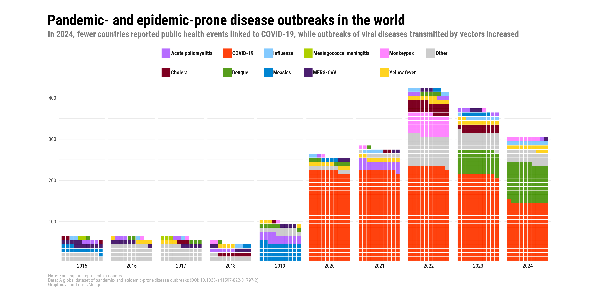

This waffle chart was developed in support of the research paper [_A global dataset of pandemic- and epidemic-prone disease outbreaks_](https://www.nature.com/articles/s41597-022-01797-2), aiming to visualize the distribution of disease outbreaks across the globe.

::: {.card}
{width=100% .lightbox}
:::

To access the source code and replicate this chart, visit my [Blog](/blog/posts/waffle-chart-disease-outbreaks/index.html).
