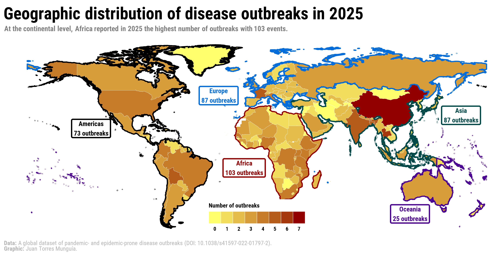

This map was developed in support of the research paper [_Global trends of pandemic-prone and epidemic-prone disease outbreaks in 2024
_](https://gh.bmj.com/content/11/2/e020708), aiming to visualize the distribution of disease outbreaks across the globe.

::: {.card}
{width=100% .lightbox}
:::

To access the source code and replicate this map, visit my [Blog](/blog/posts/world-map-disease-outbreaks-2026/index.html).
