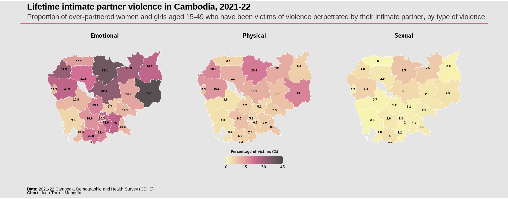

To access the source code and replicate this chart, visit my [Blog](/blog/posts/map-intimate-partner-violence-cambodia/index.html).

::: {.card}
{.lightbox fig-align="center" width=100% style="margin-top: 0px; margin-bottom: 0px;"}
:::

