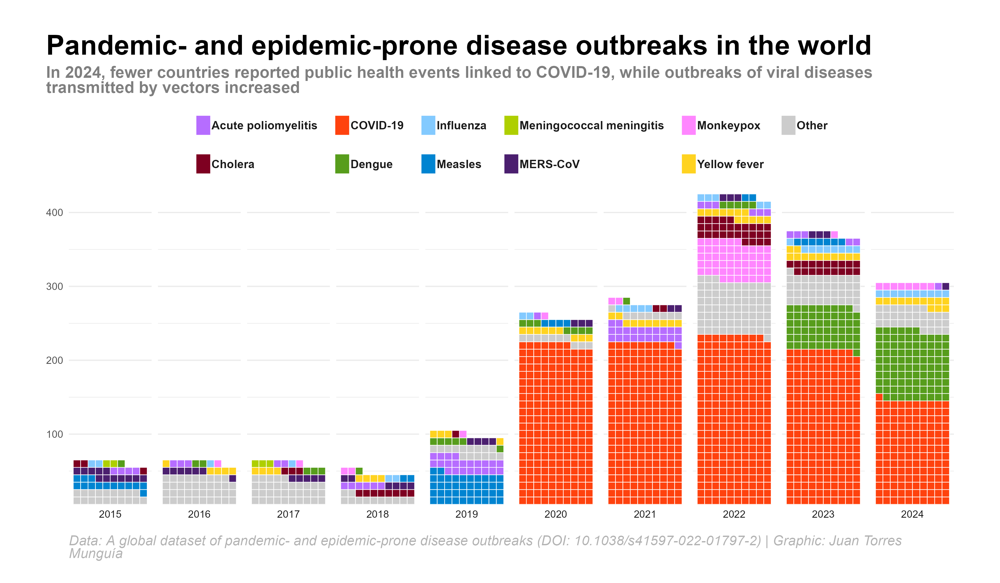

This waffle chart was developed in support of the research paper _Global Trends of Pandemic- and Epidemic-Prone Disease Outbreaks in 2024_, aiming to visualize the distribution of disease outbreaks across the globe.

::: {.card}
{width=100% .lightbox}
:::

You can read the full paper [here]().

To access the source code and replicate this chart, visit my [Blog](../blog/posts/waffle_chart_disease_outbreaks/index.qmd).